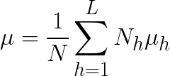
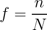

# A/B Testing, Part 2

## Can we trust an A/B Test?

* **Statistical Power** - the probability that a test will detect a difference between two values when there **really** is a difference
  * It increases as you make your sample size larger
* Suppose you run 100 A/B Tests, with a power of 80% and significance level of 5%
  * Suppose 10 of these tests are actually positive tests
  * Then with 80% power, there are 8 successes
  * But with a significance level of 5%, there are 5 false positives
  * That means 8 + 5 = 13 successes
* The the more tests that are run, the increased chances of getting a false positive

### Can you stop a test?

* Many A/B testing tools will stop a test as soon a very large result is achieved (peeking)
  * Actually that increases the number of false positives

### Can you run multiple Tests?

* A) Run multiple A/B Tests simultaneously because something will be successful
* B) **Post Test Segmentation** - split up the samples and see which subset of subset is successful
  * Suppose &alpha;=0.05 again. If you run 20 tests that in reality don't do anything, you will get 1 positive result

### Regresion to the mean

* Test a class of students a 100-question true false test and instruct them to choose answers randomly. *E(X)* = 50
  * Take the top scoring 10% and test them again. Their next scores will be lower because *E(X)* is still 50
* If you test the winning test again, the new score will be lower.

### One tail vs Two Tail

* A 2-tail test will test for effects both positive and negative.
* A 1 tail test will test for effects in one direction, which we always assume to be good.
  * It provides more power to detect an effect

* **Winner's Curse** - we only select the tests with the highest uplift. So we will  favor the tests with the least power.

## Stratified Sampling

* **[Stratified Sampling](https://en.wikipedia.org/wiki/Stratified_sampling)** - a method of sampling a population where each strata (a.k.a. sub-population) are in some way represented in each sample
  > <!--
    \mu = \frac{1}{N} \sum_{h=1}^L N_h\mu_h -->
  * Strata must be mutually exclusive and collectively exhaustive - each element must belong to 1 and only 1 strata
  * Reduces variance
* **Proportional Allocation** - a proportion of each strata is added to sample based on the fraction of that strata to the whole population
  > <!--
    f = \frac{n}{N} -->
* **Optimum Allocation** - also considers standard deviation too

## A/B Testing allocation

* If multiple A/B Tests are being run simultaneously, each member/user can be part of several tests.
  * Make sure the test don't conflict (a user can see other variants of the same testing cell
* Give admins a **Interface** to view which user is in part of which tests
* **Batch Allocation** - resolve to a fixed and known set of users, very straightforward
  * Cons:
    * can't allocate new users
    * can't allocate based on real-time user behavior
    * can't guarantee the user will ever access the feature being tested
* **Real Time allocation** - user is eligible if they meet certain criteria as they interact with the application
  * split users on user classification, or device, or geographic region
  * cons: latency from making additional calls.
    * solution run call in parallel when doing something else before
  * Can't estimate how long it will take to have sufficient data

## A/B Testing workflow

1. User accesses a feature on the front end
2. The front end calls the main application API, delivering a payload containing session and user information to the main appplication backend
3. The back end calls the A/B testing service
4. The A/B Testing service passes along all necessary context to the A/B testing server for evaluation
  * The server retrieves all tests to which this user is allocated
  * For users with batch allocation, the appropriate test is known
  * Otherwise the server determines the correct (real time) allocation
5. The server responds with test info to the A/B service, which passes that info back to the backend
6. With the test info, the backend fetches and delivers whatever media is necessary back to the user front-end

## A/B Testing server

* The Netflix stack
  * Cassandra - DB, where allocation rules are stored
  * EVCache - caches frequently used data- reduces calls made to Cassandra DB store if user made the same call in the past 3 hours
  * Kafka - handles streaming data
  * Spark - parses streaming jobs

## Sources

* [Most Winning A/B Test Results are Illusory](https://dtizncz8yxdah.cloudfront.net/media/2017/12/13074125/qubit-research-ab-test-results-are-illusory.pdf)
* 
* [Stratified Sampling](https://en.wikipedia.org/wiki/Stratified_sampling)
