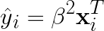
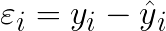
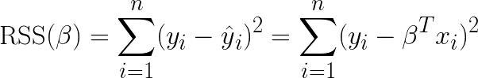
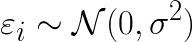
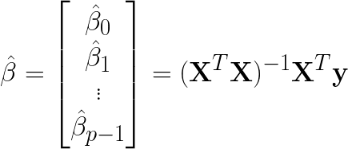
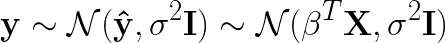
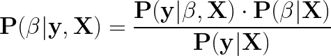

# Bayesian Linear Regression

* You definitely want to see the README on [Frequentist Linear Regression](./frequentist-linear-regression.md) before continuing.

* Recall for any given <strong><em>yi</em></strong>:
  > <!--
    y_i = \beta^2\mathbf{x}_i^{T} + \varepsilon_i
    -->
* Let <strong><em>y&#770;</em></strong> be the estimated value of <strong><em>y</em></strong>:
  > <!--
    \hat{y}_i = \beta^2\mathbf{x}_i^{T}
    -->
* In other words, the residuals are the difference between <strong><em>y</em></strong> and <strong><em>y&#770;</em></strong>
  > <!--
    \varepsilon_i = y_i - \^{y}_i
    -->
* And now we revisit residual sum of squares
  > <!--
    {\mathrm{RSS}(\beta) = \sum_{i=1}^n(y_i-\hat{y}_i)^2=
    \sum_{i=1}^n(y_i-\beta^Tx_i)^2}
    -->
* The residuals themselves are a normal distribution:
  > <!--
    \varepsilon_i \sim \mathcal{N}(0,\sigma^2)
    -->
  * (Tilde symbol means &ldquo;[has the distribution of](http://mathworld.wolfram.com/Tilde.html)&rdquo;

### Ordinary Least Squares

* Let&rsquo;s think of <strong><em>&beta;</em></strong> in terms of Bayesian inference. Find the maximum likelihood estimate of <strong><em>&beta;</em></strong>,  as a function of <strong><em>X</em></strong> and <strong><em>y</em></strong>
  > <!--
    \hat{\beta} =
    \begin{bmatrix}\hat{\beta}_0\\ \hat{\beta}_1\\\vdots\\ \hat{\beta}_{p-1} \end{bmatrix} =
    (\mathit{\mathbf{X}}^T\mathit{\mathbf{X}})^{-1}\mathit{\mathbf{X}}^T\mathit{\mathbf{y}}
    -->
* In Frequentist Linear Regression, the model is informed just by the data, and everything we need to know for the model will come from the data.
* What if the size of the dataset is small? Then the estimate will be a distribution of possible values.
* <strong><em>Bayesian Linear Regression</em></strong> - linear regression is a probability distribution, rather than point estimates. In other words, we want to find the probability distribution of <strong><em>&beta;</em></strong>
* <strong><em>y</em></strong> follows a normal distribution where the mean is the estimated value of <strong><em>y&#770;</em></strong>, with a variance of <strong><em>&sigma;2</em></strong> times the identity matrix <strong><em>I</em></strong>:
  > <!--
    \mathbf{y} \sim \mathcal{N}(\mathbf{\hat{y}},\sigma^2\mathbf{I}) \sim
    \mathcal{N}(\beta^T\mathbf{X},\sigma^2\mathbf{I})
    -->
* The probability of the parameters, given y and x:
  > <!--
    \mathbf{P}(\beta|\mathbf{y}, \mathbf{X}) =
    \frac{\mathbf{P}(\mathbf{y}|\beta, \mathbf{X}) \cdot \mathbf{P}(\beta|\mathbf{X})}{\mathbf{P}(\mathbf{y}|\mathbf{X})}
    -->

### Bayesian Linear Modeling

* Implementing Bayesian Linear Regression
  * Specify priors for model parameters (use normal distribution for non-informative priors)
  * Create a model that maps the inputs to the outputs
  * Use a Markov Chain Monte Carlo (MCMC) algorithm to draw samples from the posterior distributions for the parameters

* First, establish a baseline!
  * [Recall](./frequentist-linear-regression.md#metrics) that two metrics to measure accuracy for regression are Mean Absolute Error (MAE) and Root Mean Squared Error (RMSE)
  * A way create a baseline is to get the MAE and RMSE when we predict the result of <em>y</em> is always the median of <em>y</em>. Any model created afterwards must at least beat these values.

## Sources

* [Introduction to Bayesian Linear Regression](https://towardsdatascience.com/introduction-to-bayesian-linear-regression-e66e60791ea7) - Will Koehsen
* [Tilde](http://mathworld.wolfram.com/Tilde.html)

