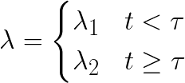

# Bayesian Programming

Notes from Probabilistic Programming and Bayesian Methods for Hackers

* Measure probability in terms of the believability of an event. How confident are we the event will occur?

## Example

* Suppose the number of text messages are recorded every day for a period of time. Can we detect a change in behavior (e.g. texts increase or decrease over time at some point)
* For day <em>i</em> with count <em>Ci</em>, we can say <em>Ci = Poisson(&lambda;)</em>
* For all the days <strong><em>t</em></strong> during the observation period, choose some day <strong>&tau;</strong> such that <strong>&lambda;</strong> before <strong>&tau;</strong> is lower than <strong>&tau;</strong> after <strong>&tau;</strong>. Let this day be called the <em>switchpoint</em>
  > <!--
  {\lambda = \begin{cases}\lambda_1 & t < \tau\\\lambda_2 & t \ge\tau\end{cases}}
  -->
* If no change occurred, then both lambdas are equal, and the posterior distributions for each should be equal.
* Let the prior probability each <em>&lambda;</em> be itself an exponential distribution with hyper-parameter <em>&alpha;</em>
* Rule of thumb: set the exponential parameter equal to the inverse of the average of the count data.
* When does <strong>&tau;</strong> occur? Since we don't know, assign every day equal probablity (uniform)
  * <em>&tau; ~ U(1,70)</em>
  * There are 70 days, so <em>P(&tau; = k) = 1/70</em>

* Python: refer to [015-poisson.py](../demos/bayesian-programming/015-pymc.py)

* PyMC notes in [libraries doc: PyMC](./libraries/pymc.md)

