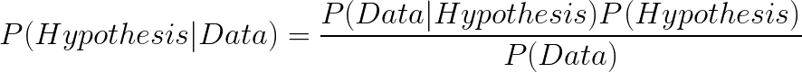
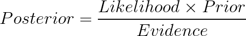

# Bayesian Statitistics with PyMC3

## Introduction

* Recall Bayes' Theorem
  > <!--
    {P(B|A) = \frac{P(A|B)P(B)}{P(A)}}
    -->
* Switch the letters to H and D
  > <!--
    {P(\mathcal{H}|\mathcal{D}) = \frac{P(\mathcal{D}|\mathcal{H})P(\mathcal{H})}{P(\mathcal{D})}}
    --}>
* Where H is probability of hypothesis being true, and D is probability of data being true
  > <!--
    {P(Hypothesis|Data) = \frac{P(Data|Hypothesis)P(Hypothesis)}{P(Data)}}
    -->
* Finally, the application of Bayes' theorem
  > <!--
    {Posterior = \frac{Likelihood \times Prior}{Evidence}}
    -->

* [Examle 1](./example-01.py) - coin flips with simulation

## Bayesian Inference of a Binomial Proportion

### Bayesian Approach

* <strong>Assumptions</strong>
  * There are only two outcomes, success and failure.
  * The outcomes are random
  * Each outcome is independent of previous outcomes
  * &ldquo;Independent and Identically Distributed Random Variables&rdquo; IID
  * The hypothesis <em>&theta;</em> of success or failure is a <em>stationary process</em>, e.g., does not change over time
* <strong>Prior Beliefs</strong>
  * Must quantify prior beliefs about hypothesis <em>&theta;</em> with a distribution
  * Use Beta distribution to model beliefs
* <strong>Experimental Data</strong>
  * Carry out trials to get data
  * Determine probability of success given a particular <em>&theta;</em>, e.g., likelihood function
* <strong>Posterior Beliefs</strong>
  * Calculate posterior belief using prior belief and likelihood function
  * If prior is beta distribution and likelihood is a Bernoulli, then posterior is a beta.
* <strong>Inference</strong>
  * Estimate <em>&theta;</em> with posterior beliefs
  * Predict probability of success on next trial

## Sources

* [Bayesian Statistics: A Beginner's Guide](https://www.quantstart.com/articles/Bayesian-Statistics-A-Beginners-Guide)
* [Bayesian Inference of a Binomial Proportion - The Analytical Approach](https://www.quantstart.com/articles/Bayesian-Inference-of-a-Binomial-Proportion-The-Analytical-Approach)
* [Markov Chain Monte Carlo for Bayesian Inference - The Metropolis Algorithm](https://www.quantstart.com/articles/Markov-Chain-Monte-Carlo-for-Bayesian-Inference-The-Metropolis-Algorithm)
* [Bayesian Linear Regression Models with PyMC3](https://www.quantstart.com/articles/Bayesian-Linear-Regression-Models-with-PyMC3)

