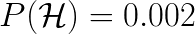
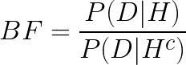
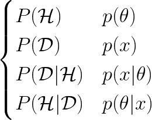
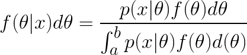
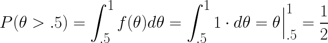

# Bayesian Statistics

## Bayesian Versus Frequentist Approaches

* <strong>Bayesian Statistics</strong> - a particular approach to applying probability to statistical prolems by providing mathematical tools to update prior beliefs about random events based on new data.
  * [model the parameters](https://www.quora.com/What-is-the-difference-between-Bayesian-and-frequentist-statisticians) and assign probability to them
  * Unknown parameters are treated as having probability distributions
  * Conclusions are subjective and we can update them as new data is collected
  * <strong>Bayesian Inference</strong> - probability is a measure of the believability or confidence about the occurence of an event.
  * Try to define uncertainty
* <strong>Frequentist Statistics</strong> - probability is a measure of the frequency of particular random events occuring over repeated trials
  * Try to eliminate uncertainty with estimates
  * Conclusions are objective and probability is calculated by analyzing the frequency of events from lots of trials or experiments
  * model the data and assign probability to them

## Bayes&rsquo; Theorem in Statistics

### Inference Examples

* <strong>Engineering</strong> - proportion of widgets that have a defect after fabrication
* <strong>Social Science</strong> - proportion of people who would respond &ldquo;yes&rdquo; on a survey question
* <strong>Medicine</strong> - proportion of patients who recover after taking a drug
* <strong>Finance</strong> - proportion of transactions that fail audits
* <strong>A/B Testing</strong> - proportion of users who click a button when using an application

### Bayes&rsquo; Theorem

* **Prior Inference** - (first analyze the sample data and draw a conclusion)[https://www.quora.com/What-are-the-principles-of-Bayesian-statistics]
* **Posterior Inference** - Then analyze another set of sample data and revise the conclusion
* **Bayesian Logic** - *use knowledge of prior events to predict future events*
* Recall Bayes' Theorem
  > <!--
    {P(B|A) = \frac{P(A|B)P(B)}{P(A)}}
    -->
* Switch the letters to H and D
  > <!--
    {P(\mathcal{H}|\mathcal{D}) = \frac{P(\mathcal{D}|\mathcal{H})P(\mathcal{H})}{P(\mathcal{D})}}
    -->
* Where H is probability of hypothesis being true, and D is probability of data being true
  > <!--
    {P(Hypothesis|Data) = \frac{P(Data|Hypothesis)P(Hypothesis)}{P(Data)}}
    -->
* Finally, [the application](https://towardsdatascience.com/probability-for-data-science-9770b26643d0) of Bayes' theorem
  > <!--
    {Posterior = \frac{Likelihood \times Prior}{Evidence}}
    -->
* **Experiment** - what you do to get the result, e.g, flip a coin, screen a patient
* **Data** - the result of the experiment, e.g., the screening test is positive, the coin flip is heads
  * The probability of the data is Type 1
* **Hypothesis** - the probability itself, e.g, the coin is fair, the test, the patient has the disease
  * The probability of the hypothesis is Type 2
  * This probability has a prior *P(H)* (before the data) and posterior *P(H|D)* (after the data)
* **Prior** = the probability before running the experiment
* **Likelihood** - same as MLE - assume the hypothesis is true, then what what is the probability of the data? E.g., if the coin is fair, what is the probability of getting heads? If the patient has the disease, what is the probability of testing positive?
* **Bayes Numerator** - prior &times; likelihood
* **Posterior** - probability of hypothesis, given the data
* *P(H|D)* - The probability that the hypothesis is true, given the data that is collected

### Sidebar: 3 variables

* What is the the probablity of B, given Y and X?
  > <!--
    \mathbf{P}(B|Y, X) =
    \frac{\mathbf{P}(Y|B, X) \cdot \mathbf{P}(B|X)}{\mathbf{P}(Y|X)}
    -->

### Gene Example:
* The rate of the foo gene in a population is 0.002, or 0.2%.
* The screening test for a gene has a 1% false positive rate and a 1% false negative rate
* *What is the probability that a randomly selected person tests positive?*
  * In other words, what is the probability that a person has the gene given that they test positive?
  * Hypothesis: *H* = person has gene
  * Data: *D* = the test is positive
  * To solve for the right-hand side of Bayes' Theorem:
    * What is the probability that a person's test is positive, given that they have the gene? 99% (because of the 1% false negative)
    * What is the probability of having the gene? 0.2%
    * What is the probability of the test being positive?
      * The probability of a true positive + a false positive: 0.99 * 0.002 + 0.01 * 0.998 = 0.01196
    * right-hand side: (0.99 * 0.002)/0.01196 = **0.166**

    * In other words, the probability of having the foo gene is 0.002
    * What is the probability that a person has the foo gene given that they test positive?
    * Hypothesis: H = person has the foo gene
    * Data: D = the test is positive
    * Likelihood - probability of a positive test if you have the gene
      > <!--
        {Likelihood = P(\mathcal{D}|\mathcal{H}) = 0.99}
        -->
    * Prior - probability of having the gene
      > <!--
        {Prior = P(\mathcal{H}) = 0.002}
        -->
    * Evidence - a true positive test for those who have the gene, and a false positive for those who don't have it
      > <!--
        {Evidence = P(\mathcal{D}) = 0.99(0.002) + 0.01(0.998) = 0.01196}
        -->
* **Base Rate Fallacy**
  * It's worth pausing on this result for a bit. The probability that a patient who tests positive actually has the disease less than 17%, despite the test being 99% accurate. Why so low?
    * Suppose the population was a thousand people. Then the expected number of people who actually have the disease is 2. Of the remaining 998 people, 1% of them will test positive. which will be about 10 other people.
* **Statistical Inference** - estimate the probability of parameters, given a parametric model and its observed data. These parameters can be thought of as hypotheses. So we are estimating the probability of hypotheses, given data.
* **Maximum Likelihood Estimate (MLE) - for which parameter value does the observed data have the biggest probability? (point estimate)
  * Example: What is the MLE of the probability *p*, given 55 heads from 100 coin flips?
    * *P(55 heads | p)*
    * The derivative will get 0.55
* **Type 1 Probability** - the standard probability of data (e.g. probability of getting heads)
* **Type 2 Probability** - The probability of hypothesis (e.g. the coin is *A*

### Bayesian Updating

#### Above example, again.

* To better understand the information create a **Bayesian Update Table**
* Let *G+* = you have the gene, *G-* = you do not have the gene
* let *x=1* mean the test is positive

<table>
    <tr>
        <th>Hypothesis</th>
        <th>Prior</th>
        <th>Likelihood</th>
        <th>Numerator</th>
        <th>Posterior</th>
    </tr>
    <tr>
        <td><em>&theta;</em></td>
        <td><em>p(&theta;)</em></td>
        <td><em>p(x=1|&theta;)</em></td>
        <td><em>p(x=1|&theta;)p(&theta;)</em></td>
        <td><em>p(&theta;|x=1)</em></td>
    </tr>
    <tr>
        <td><em>G+</em></td>
        <td>0.002</td>
        <td>0.99</td>
        <td>0.00198</td>
        <td>0.16552</td>
    </tr>
    <tr>
        <td><em>G-</em></td>
        <td>0.998</td>
        <td>0.01</td>
        <td>0.00998</td>
        <td>0.83445</td>
    </tr>
    <tr>
        <td><em>Total</em></td>
        <td></td>
        <td></td>
        <td>0.01196</td>
        <td></td>
    </tr>
</table>

#### Coin example

* There are 3 coins:
  * *A* coins are fair 0.5 probability heads
  * *B* coins have 0.6 probability heads
  * *C* coins have 0.9 probability heads.
  * Suppose there are 5 coins, 2 *A*, 2 *B*, and 1 *C*
  * Pick one coin at random, flip it, and it lands heads.
  * What is the probability that the coin is *A*? or *B* or *C*?
    > <!--
      {\begin{cases}0.4 & A\begin{cases}0.5 & H=0.2\\0.5 & T=0.2\end{cases}\\0.4 & B\begin{cases}0.6 & H=0.24\\0.4 & T=0.16\end{cases}\\0.2 & C\begin{cases}0.9 & H=0.18\\0.1 & T=0.02\end{cases}\end{cases}}
      -->
    * Data is the evidence: the evidence is heads
    * In other words, find *P(A|D), P(B|D), P(C|D)
    * First what is the probability of getting a coin? This is prior knowledge.
    * *P(A)* = 0.4, *P(B)* = 0.4, *P(C)* = 0.2
    * Then probability of heads is the probability of getting heads for each coin
      * In other words, the evidence is the probability of data, e.g., the probability of getting heads
    * **Bayes' Numerator** - prior &times; likelihood
    * *P(D)* = 0.5*0.4 + 0.6*0.4 + 0.9*0.2 = 0.2 + 0.24 + 0.18 = 0.62
    * Using Bayes' Theorem, *P(A|D) = P(D|A)*P(A)/P(D) = 0.5*0.4/0.62 = 0.3226
    * Similarly, *P(B)* = 0.3871 and *P(C)* = 0.2903
* **Predictive Probabilities** - assigining a probability to each possible outcome of an experiment.
* Example again:
  * The coin is flipped again, and it lands heads again.
  * What is the probability that the coin is *A*? or *B* or *C*?
    * The **Posterior** probability from the first round becomes the hypothesis or **Prior** for the second round
    * P(D2>) = 0.5*0.2 + 0.6*0.24 + 0.9*0.18 = 0.1 + 0.144 + 0.162 = 0.406
    * Then the probability of *A* given 2 heads is 0.1/0.406 = 0.2463

### Odds

* **Odds** the odds of event *E* vs. complement event *Ec* are *O(E) = P(E)/P(Ec)*
  * The probability of rain is 67%, and the probability of no rain is 33%. So the odds of rain are 67%/33% = "2 to 1"
* Example
  * Marfan Syndrome occurs in 1 out of every 15000 people. 3 different ocular symptoms that may occur with Marfan Syndrome are:
    * Lens dislocation, myopia, and retinal detachment.
  * 70% of people with Marfan Syndrome have at least 1 of these features
  * 7% of people without Mafan Syndrome have at least 1 of these features
  * What are the odds that someone with one of these features *F* has Marfan Syndrome?
    * Odds of having Marfan Syndrome (prior odds):
      * *O(M) = P(M)/P(MC)* = 1/14999 = 0.000067
    * Odds of having Marfan Syndrome if person has ocular feature (posterior odds):
      * *O(M|F) = P(M|F)/P(MC|F) = 0.000667
  * So posterior odds are 10 times larger than prior odds.
  * Note that the odds are still very tiny.
* **Bayes Factor** the order of magnitude that the posterior odds  is greater than prior odds.
  > <!--
    BF = \frac{P(D|H)}{P(D|H^{c})}
    -->
  * for a hypothesis *H* and data *D*
  * posterior odds = BF * prior odds
  * *BF > 1* - data provides evidence for hypothesis
  * *BF < 1* - data provides evidence against hypothesis
  * *BF = 1* - data provides no evidence either way

### Continuous Priors

* As usual when going from discrete to continuous, pmf becomes pdf, and sums become integrals
* **Paramatrized Distribution** - model the random process that creates the data
* **Hypothesis *&theta;*** - any choice of parameter, such as the probability of success
* As usual these are the probabilities we want:
  > <!--
    {\begin{cases}
    P(\mathcal{H}) & p(\theta)
    \\P(\mathcal{D}) & p(x)
    \\P(\mathcal{D}|\mathcal{H}) & p(x|\theta)
    \\P(\mathcal{H}|\mathcal{D}) & p(\theta|x)
    \end{cases}}
    -->
* recall continuous pdf - the probability that *X* is in *[c, d]*
  > <!--
    {P(c \leq d) = \int_c^d f(x)dx}
    -->
* law of total probability for discrete set (remember the coin example above) prior probability of D
  > <!--
    {P(\mathcal{D}) = \sum_{i=1}^n P(\mathcal{D}|\mathcal{H}_i)P(\mathcal{H}_i)}
    -->
  > <!--
    {p(x) = \sum_{i=1}^n  p(x|\theta_i)p(\theta_i)}
    -->
* Continuous law of total probability
  * suppose a parameter *&theta;* in the range of *[a, b]* and a discrete random data *x*.
  * *&theta;& is random, with a density function *f(&theta;)* and *x* and *&theta;* have likelihood *p(x|&theta;)*
  > <!--
    p(x) = \int_a^b p(x|\theta)f(\theta)d(\theta)
    -->
  * So now expressed as Bayes' theorem
    > <!--
      {f(\theta|x)d\theta =
      \frac{p(x|\theta)f(\theta)d\theta}{\int_a^b p(x|\theta)f(\theta)d(\theta)}}
      -->
* The prior probability is *f(&theta;)d&theta;* so the hypothesis is saying:
  * **The unknown parameter is an inteval of width *d&theta;* around *&theta;***

#### Flat priors

* **Flat Prior** - assue that every hypothesis is equally probable.
  * If *&theta;* has a range [0,1] then *f(&theta;)* = 1 is a flat prior
* Example: suppose a coin has an unknown probability *&theta;* heads.
  * A coin flip lands heads. 
  * Assume flat prior
  * What is posterior probability for *&theta;* (*&theta;* = probability a coin flip lands heads)?
  * if *&theta;* is 0.5 that means the coin neither favors heads nor tails

<table>
    <tr>
        <th>hypthesis</th>
        <th>prior</th>
        <th>likelihood</th>
        <th>Bayes numerator</th>
        <th>posterior</th>
    </tr>
    <tr>
        <td><em>&theta;</em></td>
        <td><em>f(&theta;)d&theta;</em></td>
        <td><em>p(x=0|&theta;)</em></td>
        <td></td>
        <td><em>f(&theta;|x=0)d&theta;</em></td>
    </tr>
    <tr>
        <td><em>&theta;</em></td>
        <td><em>1 &times; d&theta;</em></td>
        <td><em>1 - &theta;</em></td>
        <td><em>(1 - &theta;)d&theta;</em></td>
        <td><em>2(1 - &theta;)d&theta;</em></td>
    </tr>
    <tr>
        <td>total</td>
        <td>
          
          <!--
          {\int_a^b f(\theta)d(\theta) = 1}
          -->
        </td>
        <td></td>
        <td>
          
          <!--
          {p(x=0)=\int_a^b (1-\theta)d(\theta) = x - \frac{x^2}{2} \Big|_0^1= 1}
          -->
        </td>
        <td>1</td>
    </tr>
</table>

#### Posterior pdf

* If a coin can equally be heads or tails, then find the the probability of landing tails *P(&theta; < 5)* and heads *P(&theta; > 5)*
  > <!--
    {P(\theta>.5)=\int_{.5}^1 f(\theta)d(\theta) = \int_{.5}^1 1 \cdot d(\theta) = \theta \Big|_0^1= \frac{1}{2}}

* Okay flipping the coin lands heads. What is probability that the coin favors (biased towards) heads now?
  * *P(&theta; > 0.5|x=1)*
  * Prior: *f(&theta;)d&theta; = 1 &times; d&theta;
  * Likelihood: *&theta;*
  * Numerator: *&theta; &times; d&theta;*
  * *p(x = 1)* = *x2/2* from 0.5 to 1 = 1/2
  * Posterior: *&theta; &times; d&theta;* / (1/2) = *2&theta; &times; d&theta;* 
  > <!--
    {P(\theta>.5|x=1)=\int_{.5}^1 f(\theta|x=1)d(\theta) = \int_{.5}^1 2\theta d\theta = \theta^2 \Big|_{.5}^1= \frac{3}{4}}
    -->
* What is the probability of getting heads again? 
  * remember the integral of the probability of getting heads, given you got head on the first flip is the integral of *2&theta; &times; d&theta;*  a.k.a. the posterior
  * That becomes prior of the next round
  * likelihood of the next round is *p(x2=1|&theta;) = &theta;*
  > <!--
    {P(x_2=1|x_1=1)=\int_{0}^1 p(x_2=1|\theta,x_1=1)f(\theta|x_1=1)d\theta }
    -->
  > <!--
    {{P(x_2=1|x_1=1)=\int_{0}^1 \theta \cdot 2\theta d\theta = \frac{2\theta^3}{3} \Big|_{0}^1=\frac{2}{3}}}
    -->

### Inferential Statistics

[Try to infer these things](https://www.probabilisticworld.com/frequentist-bayesian-approaches-inferential-statistics/):

* **Parameter estimation** - some value that determines the properties of the distribution, such as \mu or \sigma
* **Data Prediction** - use information about sample to predict a random selection
* **Model comparison** - selecting a model which best explains the observed data, something that postulates the relationship between factors and the data

## Sources

* [Online equation editor](https://www.codecogs.com/latex/eqneditor.php)
* [What are the principles of Bayesian statistics?](https://www.quora.com/What-are-the-principles-of-Bayesian-statistics)
* [Probability for Data Science](https://towardsdatascience.com/probability-for-data-science-9770b26643d0)
* [What is the difference between Bayesian and frequentist statisticians?](https://www.quora.com/What-is-the-difference-between-Bayesian-and-frequentist-statisticians)
* [Frequentist And Bayesian Approaches In Statistics](https://www.probabilisticworld.com/frequentist-bayesian-approaches-inferential-statistics/)
