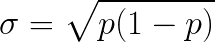

### Bernoulli Trials, Binomial Distributions

An experiment that only has two possible results - *success* and *failure* - is a **Bernoulli Trial** if:
* The results are mutually exclusive,
* The probability of these two results do not change each time the experiment is done
* **Bernoulli Distribution** - a distribution for a random variable defined as
    > 
* `X` follows a Bernoulli distribution with parameter `p` is `X ~ Ber(p)`
* Probability function:
  > 
  > 
  * The probability of failure *1 - p* is sometimes called *q*
* Cumulative Distribution Function:
    > <!--
      F(x) =\begin{cases}0 & x < 0\\1 - p & 0  \leq x < 1\\1 & x  \geq 1\end{cases}
      -->
* **Binomial Coefficient** - the number of ways of picking *k* unordered outcomes from *n* possibilities, or "*n* choose *k*"
  > 
  * For example, 4C2 = 6
  * From a set of 4 numbers {1, 2, 3, 4} choosing 2 unordered numbers  will yield 6 subsets {1,2}, {1,3}, {1,4}, {2,3}, {2,4}, {3,4}
* **Binomial Distribution** is the model for *n* independent Bernoulli trials with a *p* probability, then `X ~ Bin(n,p)`
  * Therefore *Bin(1,p) = Ber(p)*
  > <!--
    {P(X = k) =
    \begin{pmatrix}n \\k \end{pmatrix}p^{k}(1-p)^{n-k} =
    \big({\frac{n!}{k!(n - k)!}}\big)p^{k}(1-p)^{n-k}}
    -->
* **Mean** of a Bernoulli Trial is its probability *&mu; = p*
* **Expected Value** of a Bernoulli Trial is *E(X) = 0(1-p) + 1(p) = p*
* **Expected Value** of a Binomial distribution is *E(X) = np*
* [Variance of](https://ocw.mit.edu/courses/mathematics/18-05-introduction-to-probability-and-statistics-spring-2014/readings/MIT18_05S14_Reading5a.pdf) a Bernoulli Trial
  > 
  * Proof

    |        Values *X*        |           0           |          1          |
    |:------------------------:|:---------------------:|:-------------------:|
    |        pmf *p(x)*        |        *(1-p)*        |         *p*         |
    | *(X - &mu;)2* | *(0 - p)2* | *(1-p)2* |

  * *Var(X) = (1 − p)p2 + p(1 − p)2 = (1 − p)p(1 − p + p) = (1 − p)p.*
* [Standard Deviation](https://math.stackexchange.com/questions/1716156/sd-of-a-bernoulli-trial) of a Bernoulli Trial
  > 

## Examples

### What the probabilities of flipping *k* heads in 5 coin flips?

* The probability for heads is success *p* = 0.5, so failure is *1 - p* = 0.5
* The probabilities of 0 heads is 5 failures, 0.55 = 0.03125
* Likewise the probability of 5 heads 0.55 = 0.03125
  * 5C0 = 5!/(0!*5!) = 1
  * 5C1 = 5!/(1!*4!) = 5
  * 5C2 = 5!/(2!*3!) = 10
  * 5C3 = 5!/(3!*2!) = 10
  * 5C4 = 5!/(4!*1!) = 5
  * 5C5 = 5!/(5!*0!) = 1

    | value |    *a* | 0                      | 1                                   | 2                                    | 3                                   | 4                                   | 5                      |
    |-------|-------:|------------------------|-------------------------------------|--------------------------------------|--------------------------------------|-------------------------------------|------------------------|
    | pmf   | *p(a)* | *(1 - p)5* | *5p1(1 - p)4* | *10p2(1 - p)3* | *10p3(1 - p)1* | *5p4(1 - p)* | *p5* |
    | pmf   | *p(a)* | 0.03125                | 0.15625                             | 0.3125                               | 0.3125                               | 0.15625                             |  0.03125               |
    | cdf   | *F(a)* | 0.03125                | 0.1875                              |                                  0.5 |                               0.8125 |                             0.99875 |                      1 |                   1 |

### What is the probability that passengers show up on a plane?

* The plane has 50 seats.
* All seats have been sold.
* For every passenger, there is a 5% chance they do not board.
 * In other words = *X = Bin(50, 0.95)*

* What is the probability that all 50 passengers show up?
  * 50 independent success, or 0.9550 = 7.694%
* What is the probability that exactly 49 passengers show up?
  > 
* What is the probability at least 48 passengers show up?
  * *P(X &ge; 48) = 1 - P(X = 50) - P(X = 49) = 72.06%

## Sources
* [Online equation editor](http://www.sciweavers.org/free-online-latex-equation-editor)
  * Bernoulli random variable: `X =\begin{cases}1 & success\\0 & failure\end{cases}`
  * Failure Probability: `P(X = 0) = 1 - p`
  * Success Probability: `P(X = 1) = p`
  * Binomial Coefficient: `_nC_k =  \begin{pmatrix}n \\k \end{pmatrix} = \frac{n!}{k!(n - k)!}`
  * Bernoulli Variance: `Var(X) = p(1 - p)`
  * Bernoulli Standard Deviation: `\sigma =  \sqrt{p(1-p)}`
  * Coin flip example: `(\frac{5}{3})0.5^3(1 - 0.5)^{5 - 3} = (\frac{5}{3})0.5^3(0.5)^{2} = 0.05208 \overline{3} `
  * Plane ticket example 1: `P(X = 49) = \begin{pmatrix}50 \\49 \end{pmatrix}0.95^{49}(1-0.95)^{50-49} = 50 *0.95^{49}*0.05 = 0.2025`
* [Binomial Coefficient](http://mathworld.wolfram.com/BinomialCoefficient.html)
* [Some probabilistic models](http://www.est.uc3m.es/esp/nueva_docencia/getafe/economia/estadistica_I/doc_generica/Chapt1_Part-C_Print.pdf)
* [What is the difference and relationship between the binomial and Bernoulli distributions?](https://math.stackexchange.com/questions/838107/what-is-the-difference-and-relationship-between-the-binomial-and-bernoulli-distr)
* [SD of a bernoulli trial?](https://math.stackexchange.com/questions/1716156/sd-of-a-bernoulli-trial)
* [Variance of Discrete Random Variables](https://ocw.mit.edu/courses/mathematics/18-05-introduction-to-probability-and-statistics-spring-2014/readings/MIT18_05S14_Reading5a.pdf)
* [Markdown Tables Generator](https://www.tablesgenerator.com/markdown_tables)
