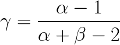
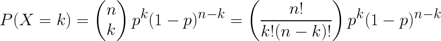

# Beta Distribution

* The beta distribution is mostly considered within the context of Bayesian statistics.
* Levels of distributions
  * Bernoulli Trials: probability of success/ failure, e.g., one coin flip
  * Binomial Distribution: proportion of success, e.g, number of heads, given <em>n</em> coin flips
  * Beta Distribution: probability of success given proportion of success, e.g., probability of fair coin, given <em>&alpha;</em> heads and <em>&beta;</em> tails.

### Baseball

* A player's batting average is the proportion of hits to total number of plate appearances.
  * Anything above .300 is very good, anything below .215 is terrible
  * At the beginning a season the batting average is meaningless if you ignore prior knowledge
    * A player scoring a hit from 2 plate appearance has .500 average
    * A player striking out in first 1 appearances has a .000 average
    * Suppose last season a player had 80 hits and 220 outs for a total of 300 at-bats
    * The batting average of this player is a [beta distribution](http://varianceexplained.org/statistics/beta_distribution_and_baseball/) *beta(80,220)*

### The Beta Distribution and its measures

* **Beta Distribution** - beta(a, b) 2-parameter distribution with range [0,1]
  > <!--
    {f(\theta) = \frac{(a+b-1)!}{(a-1)!(b-1)!}\theta^{a-1}(1-\theta)^{b-1}}
    -->
* *a* and *b* are called **hyperparameters**, they are different than the hypothesis parameter *&theta;*
* That fraction area is called a normalizing constant
  > <!--
    {c = \frac{(a+b-1)!}{(a-1)!(b-1)!}, c\theta^{a-1}(1-\theta)^{b-1}}
    -->
* Beta Mean: [Expected Value](http://pj.freefaculty.org/guides/stat/Distributions/DistributionWriteups/Beta/Beta.pdf)
  > <!--
    E(\theta) = \mu = \frac{a}{a+b}
    -->
* Variance
  > <!--
    \sigma^2  = \frac{a\cdot b}{(a+b)^2(a + b + 1)}
    -->
* Mode: aka what is peak of the curve?
  > <!--
    \gamma  = \frac{a-1}{a+b-2}
    -->
* Solve for <em>&alpha;</em>
  > <!--
    {\alpha = \left(\frac{1-\mu}{\sigma^2} - \frac{1}{\mu} \right) \mu^2}
    -->
* Solve for <em>&beta;</em>
  > <!--
    {\beta = \alpha\left( \frac{1}{\mu} - 1 \right)}
    -->

#### A note about standard deviation of beta

* Recall the standard deviation of a uniform distribution
  > <!--
    \sigma = \frac{b-a}{\sqrt{12}}
    -->
* In a beta distribiton the hypothesis <em>&theta;</em> is between 0 and 1. Therefore, a uniform prior is:
  > <!--
    \sigma = \frac{1 - 0}{\sqrt{12}} = 0.28868
    -->
* Therefore, (while possible) a beta distribution should not have a standard deviation greater than 0.28868 because a uniform prior has no beliefs

### Graph

<p align="center">
  
</p>

```python
import scipy.stats as stats

alpha = 9
beta = 5
distribution = stats.beta(alpha, beta)
```

* Full code available at [matplotlib_03_beta.py](../demos/libraries/matplotlib/matplotlib_03_beta.py)

### Example: coin flips

* What is the probability of getting 8 heads and 4 tails from a coin flip?
  * n = 8 + 4 = 12
  * This is a binomial distribution
  > <!--
    {P(X = k) =
    \begin{pmatrix}n \\k \end{pmatrix}p^{k}(1-p)^{n-k} =
    \big({\frac{n!}{k!(n - k)!}}\big)p^{k}(1-p)^{n-k}}
    }
  * The posterior pdf for a binomial distribution is also a binomial distribution since we are still dealing with bernoulli trials
  * If we solve for the posterior with *&theta;* from 0 to 1, the answer must be 1 - that is the normalizing constant
  > 
  * We had 8 heads and 4 tails before
    * 8 = a - 1, a = 9
    * 4 = b - 1, b = 5
  * **likelihood** What is the probability of getting *k* successes out of *n* samples?
  * The posterior for a coin with 8 heads and 5 tails is therefore a *beta(9,5)* distribution

<table>
    <tr>
        <th>hypothesis</th>
        <th>prior</th>
        <th>likelihood</th>
        <th>Bayes Numerator</th>
        <th>Posterior</th>
    </tr>
    <tr>
        <td></td>
        <td></td>
        <td></td>
        <td></td>
        <td></td>
    </tr>
</table>

* what about tossing the coin again, getting *n* heads and *m* tails?
* What about tossing the coin *N* times again, getting *x* heads (successes)?


<table>
    <tr>
        <th>hypothesis</th>
        <th>prior</th>
        <th>likelihood</th>
        <th>Bayes Numerator</th>
        <th>Posterior</th>
    </tr>
    <tr>
        <td><em>&theta;</em></td>
        <td><em>x</em></td>
        <td><em>beta(a, b)</em></td>
        <td><em>Bin(n + m, &theta;)</em></td>
        <td><em>beta(a + n,b+m)</em></td>
    </tr>
    <tr>
        <td></td>
        <td></td>
        <td></td>
        <td></td>
        <td></td>
    </tr>
</table>

* Prior Constant
> <!--
  c_1 = \frac{(a+b-1)!}{(a-1)!(b-1)!} -->
* Likelihood Constant
  > <!--
  c_2 = \begin{pmatrix}N \\x \end{pmatrix} = \frac{N!}{x!(N-x)!} -->
* Posterior Constant
  > <!--
  c_3 = \frac{(a+b+N-1)!}{(a+x-1)!(b+N-x-1)!} -->

  * notice that the peak of the curve approaches the expected value as the hyperparamters get larger

### Conjuate Priors

* **Conjugate Prior** - if the posterior is the same probability distribution family as the the prior, then they are conjugate distributions
  * If the likelihood function is binomial and the the prior distribution is beta, then the posterior is also beta
* *No more integrals of integrals*

### Inferential Statistics

[Try to infer these things](https://www.probabilisticworld.com/frequentist-bayesian-approaches-inferential-statistics/):

* **Parameter estimation** - some value that determines the properties of the distribution, such as \mu or \sigma
* **Data Prediction** - use information about sample to predict a random selection
* **Model comparison** - selecting a model which best explains the observed data, something that postulates the relationship between factors and the data


## Sources

* [Online equation editor](https://www.codecogs.com/latex/eqneditor.php)
  * get beta
    * beta distribution: ``
    * normalizing constant: `{c = \frac{(a+b-1)!}{(a-1)!(b-1)!}, c\theta^{a-1}(1-\theta)^{b-1}}`
    * beta posterior: `c_2\int_0^1 \theta^{a-1}(1-\theta)^{b-1}d\theta`
* [Beta Distributions](https://ocw.mit.edu/courses/mathematics/18-05-introduction-to-probability-and-statistics-spring-2014/readings/MIT18_05S14_Reading14a.pdf)
* [Beta Distribution](http://pj.freefaculty.org/guides/stat/Distributions/DistributionWriteups/Beta/Beta.pdf)
* [Understanding the beta distribution (using baseball statistics)](http://varianceexplained.org/statistics/beta_distribution_and_baseball/)
