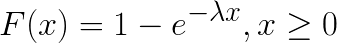
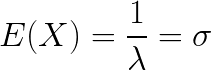
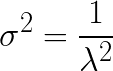

# Exponential Distribution

The exponential distribution describes the time between events of a Poisson process.

> <!--
  F(x)=1 -e^{-\lambda x}, x \ge 0
  -->

* Elaspsed time becomes the random variable.
* If the number of births within a time interval can be modelled as a Poisson distribution, then the time between births is an exponential distribution.
* The exponential distibution is used to test product reliability
* It can also be used to build Markov chains
* Other examples:
  * How much time will go by before a hurricane hits the East Coast?
  * How long will a car transmission last before it breaks?
* <strong>Exponential distributions are <em>Memoryless.</em></strong> - it does not care what came before.
  * If you are waiting for an event to occur, the length of time waiting neither increases nor decreases the probability of the event happening.
  * Suppose the probability of a taxi arriving in the next five minutes is <em>p
. If no taxi arrives, the probablity of a taxi arriving in the next five minutes is still <em>p

* Expected Value equals standard deviation
  > <!--
    E(X) = \frac{1}{\lambda} = \sigma
    -->
* Variance
  > <!--
    \sigma^2 = \frac{1}{\lambda^2}
    -->

## Sources
* [Online equation editor](https://www.codecogs.com/latex/eqneditor.php)
* [Exponential Distribution / Negative Exponential: Definition, Examples](https://www.statisticshowto.datasciencecentral.com/exponential-distribution/)
* [Exponential Distribution](https://www.statlect.com/probability-distributions/exponential-distribution)
