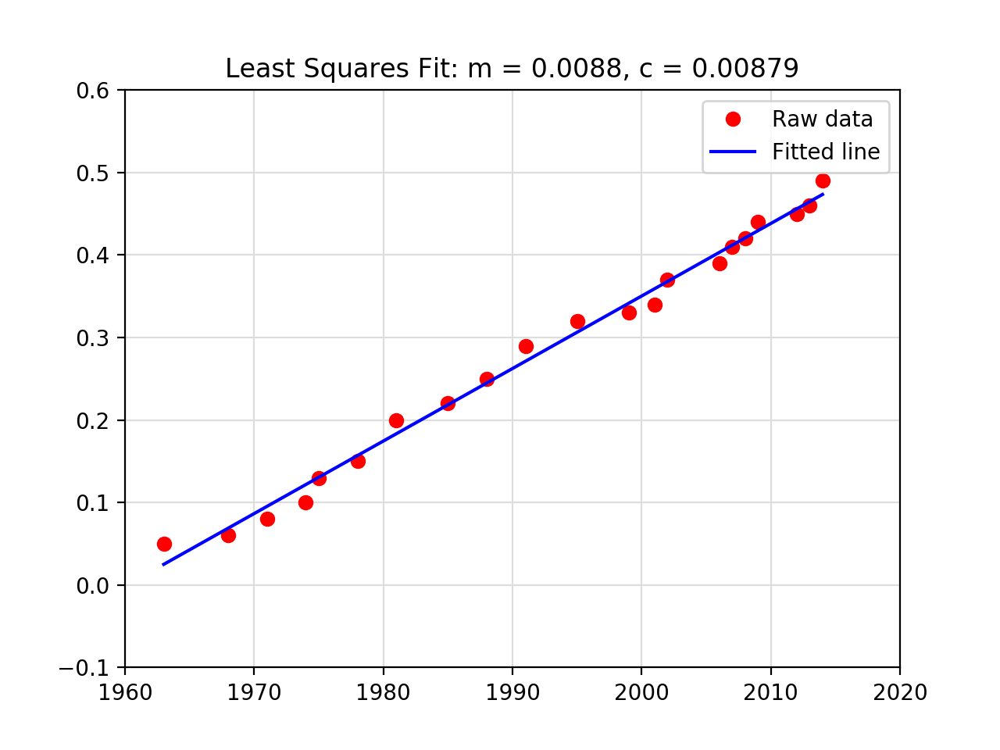

# Frequentist Linear Regression

* The goal of linear regression is to model the relationship two series of data <strong><em>x</em></strong> and <strong><em>y</em></strong> for  where

* Let <strong><em>x</em></strong> and <strong><em>y</em></strong> be bivariate data <strong><em>(x<sub>i</sub>, y<sub>i</sub>)</em></strong> for <strong><em>i = 1,&hellip;,n</em></strong>.
* <strong>Linear Regression</strong> - find a relationship for bivariate data <strong><em>(x<sub>i</sub>, y<sub>i</sub>)</em></strong>  where <strong><em>y = f(x)</em></strong> is a good fit.
  * <strong>Independent/Predictor Variable</strong> - <strong><em>x<sub>i</sub></em></strong> is not random
  * <strong>Dependent/Response Variable</strong> - <strong><em>y<sub>i</sub></em></strong> is some function of <strong><em>x<sub>i</sub></em></strong>, and with random noise
* <strong>Lease Squares Fit</strong> - a line that fits the data.

### Example

* Let <strong><em>y</em></strong> be the price of stamps every <strong><em>x</em></strong> year.

```python
import numpy as np

x = np.array([1963, 1968, 1971, 1974, 1975, 1978, 1981, 1985, 1988, 1991, 1995,
    1999, 2001, 2002, 2006, 2007, 2008, 2009, 2012, 2013, 2014])
y = np.array([.05, .06, .08, .10, .13, .15, .20, .22, .25, .29, .32, .33, .34,
    .37, .39, .41, .42, .44, .45, .46, .49])
```

* Solve for `y = Ap`, where `A = [[x 1]]` and `p = [[m], [c]]`

```python
A = np.vstack([x, np.ones(len(x))]).T
# solve for p
m, c = np.linalg.lstsq(A, y, rcond=None)[0]
```

* the result is `y = 0.00879x - 17.23146` for `m` and `c`
* Full code available at [numpy_matplotlib_lstsq.py](../demos/libraries/numpy/numpy_matplotlib_lstsq.py)

<p align="center">
  
</p>

### Residuals

* <strong>Residuals (<strong><em>&epsilon;</em></strong>)</strong> -  the difference when comparing the actual data versus applying the formula for the best fit of the data, also known as the error.

