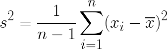
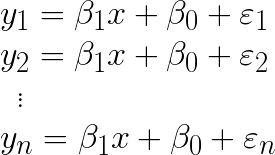
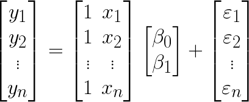
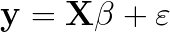

# Frequentist Linear Regression

* The goal of linear regression is to model the relationship two series of data <strong><em>x</em></strong> and <strong><em>y</em></strong> for  where

* Let <strong><em>x</em></strong> and <strong><em>y</em></strong> be bivariate data <strong><em>(x<sub>i</sub>, y<sub>i</sub>)</em></strong> for <strong><em>i = 1,&hellip;,n</em></strong>.
* <strong>Linear Regression</strong> - find a relationship for bivariate data <strong><em>(x<sub>i</sub>, y<sub>i</sub>)</em></strong>  where <strong><em>y = f(x)</em></strong> is a good fit.
  * <strong>Independent/Predictor Variable</strong> - <strong><em>x<sub>i</sub></em></strong> is not random
  * <strong>Dependent/Response Variable</strong> - <strong><em>y<sub>i</sub></em></strong> is some function of <strong><em>x<sub>i</sub></em></strong>, and with random noise
* <strong>Lease Squares Fit</strong> - a line that fits the data. We want to find this line:
  > <!--
    y = \beta_1x + \beta_0
    -->
* In Frequentist Linear Regression, the model is informed just by the data, and everything we need to know for the model will come from the data.
  * Plug in some new value for <strong><em>x</em></strong> with the above formula and we should get the mostly like result, given the data.

### Example

* Let <strong><em>y</em></strong> be the price of stamps every <strong><em>x</em></strong> year.
  ```python
  import numpy as np

  x = np.array([1963, 1968, 1971, 1974, 1975, 1978, 1981, 1985, 1988, 1991, 1995,
      1999, 2001, 2002, 2006, 2007, 2008, 2009, 2012, 2013, 2014])
  y = np.array([.05, .06, .08, .10, .13, .15, .20, .22, .25, .29, .32, .33, .34,
      .37, .39, .41, .42, .44, .45, .46, .49])
  ```
* Solve for `y = Ap`, where `A = [[x 1]]` and `p = [[m], [c]]`
  ```python
  A = np.vstack([x, np.ones(len(x))]).T
  # solve for p
  b1, b0 = np.linalg.lstsq(A, y, rcond=None)[0]
  ```
* the result is `y = 0.00879x - 17.23146` for `m` and `c`
* Full code available at [numpy_matplotlib_lstsq.py](../demos/libraries/numpy/numpy_matplotlib_lstsq.py)

<p align="center">
  
</p>


### Residuals

* <strong>Residuals (<strong><em>&epsilon;</em></strong>)</strong> -  the difference when comparing the actual data versus applying the formula for the best fit of the data, also known as the error.
  > <!--
    y_i = \beta_1x + \beta_0 + \varepsilon_i, \quad i = 1,\ldots,n
    -->
* Finding residuals in Python:
  ```python
  # get errors for each estimated y versus data y
  residuals = [(y[index] - (b1*x_i + b0)) for index, x_i in enumerate(x)]
  # get the sum of the squares of residuals
  residuals_sum = np.linalg.lstsq(A, y, rcond=None)[1][0]
  ```
* The least squares fit (essentially) is trying to find solve the above formula such that the sum of the squares of the errors is as close to zero as possible.
  > <!--
    {\mathrm{RSS}(\beta) = \sum_{i=1}^n\varepsilon_i^2 =
    \sum_{i=1}^n(y_i-\beta_1x_i-\beta_0)^2}
    -->
* Assumptions about <strong><em>&epsilon;</em></strong>:
  * <strong><em>&epsilon;</em></strong> are independent variables with a mean <strong><em>0</em></strong> and standard deviation <strong><em>&sigma;</em></strong>
  * <strong><em>&epsilon;</em></strong> follows a normal distribution
* <strong>[Homoscedasticity](https://ocw.mit.edu/courses/mathematics/18-05-introduction-to-probability-and-statistics-spring-2014/readings/MIT18_05S14_Reading25.pdf)</strong> the values of <strong><em>&epsilon;</em></strong> have the same variance
* From the above example, graph the residuals and the sum of the squares of residuals to illustrate homoscedasticity.
<p align="center">
  
</p>
* <strong>Heteroscedastic</strong> - the values of <strong><em>&epsilon;</em></strong> have different variance over <strong><em>x</em></strong>

### Summary: The Simple Linear Regression Model

Define the ["simple linear regression model"](https://newonlinecourses.science.psu.edu/stat501/node/253/) a.k.a. **LINE**

1. The expected value of <em>y<sub>i</sub></em> is a **linear function** of <em>x<sub>i</sub></em>
2. The errors <em>&epsilon;<sub>i</sub></em> are <strong>independent</strong>.
3. <em>&epsilon;<sub>i</sub></em> follows a <strong>normal distribution</strong>.
4. <em>&epsilon;<sub>i</sub></em> has equal variance (homoscedasticity).

### Coeffient of Determination, <em>R<sup>2</sup></em>

We will never know the true value of the variance <em>&sigma;<sup>2</sup></em> for the errors, because it is a population parameter. However, [recall that the sample variance for a population](./frequentist-statistics.md#student-t-distribution)  with unknown standard deviation follows a student&rsquo;s t-distribution.

> 

Important question: how much of variance of <em>y</em> is described by the variance of <em>x</em>?
* We can indirectly answer that by finding how much of the variance of  <em>y</em> is not describe by <em>x</em>? That&rsquo;s just the residual sum of squares
* (The variance of <em>y</em> comes from how far all the values of y is from the mean of y.)
* In other words,
  > <!--
    R^2 =
    1 - \frac{SS_{residuals}}{SS_{total}} =
    \frac{\sum_{i}\varepsilon_i^2}{\sum_{i}(y_i - \overline{y})^2}
    -->
* <em>R<sup>2</sup></em> is always between 0 and 1.
* If <em>R<sup>2</sup> = 1</em> then the line perfectly describes the data.
* If <em>R<sup>2</sup> = 0</em> then the line is exactly horizontal.
* &ldquo;<em>R<sup>2</sup> &times; 100%</em> of the variation in <em>y</em> is reduced by taking into account predictor <em>x</em>.&rdquo;
  * We say <em>reduced by</em> instead of <em>explained by</em> because the latter implies causality

Let the correlation coefficient <em>R</em> be:
> 

* If the slope coefficient <em>&beta;<sub>1</sub></em> is positive, then <em>R</em> is positive, and vice versa.
* <em>R</em> is a unitless number. This fact is important because it makes comparing <em>x</em> and <em>y</em> possible even if they are different units.


### Matrix formula

* Write out all the formulas for <strong><em>y</em></strong>:
  > <!--
    \newline y_1 = \beta_1x + \beta_0 + \varepsilon_1
    \newline y_2 = \beta_1x + \beta_0 + \varepsilon_2
    \newline \text{ \,} \vdots
    \newline y_n = \beta_1x + \beta_0 + \varepsilon_n
    -->
* Re-write the above formulas [as a matrix equation](https://newonlinecourses.science.psu.edu/stat501/node/382/):
  > <!--
    \begin{bmatrix}y_1\\ y_2\\ \vdots\\ y_n \end{bmatrix} =
    \begin{bmatrix}1 & x_1\\ 1 & x_2\\ \vdots & \vdots \\ 1 & x_n \end{bmatrix}
    \begin{bmatrix}\beta_0\\ \beta_1\end{bmatrix} +
    \begin{bmatrix}\varepsilon_1\\ \varepsilon_2\\ \vdots\\ \varepsilon_n \end{bmatrix}
    -->
* Sibebar: suppose the value of <strong><em>y</em></strong> depends on 2 predictors, <strong><em>x<sub>1</sub></em></strong> and <strong><em>x<sub>2</sub></em></strong>. Then we would try to solve
  > <!--
    {y_i = \beta_2x_2 + \beta_1x_1 + \beta_0 + \varepsilon_i,
    \quad i = 1,\ldots,n}
    -->
  * In which case, the matrix would be:
  > <!--
    \begin{bmatrix}y_1\\ y_2\\ \vdots\\ y_n \end{bmatrix} =
    \begin{bmatrix}1 & x_1 & x_1\\ 1 & x_2 & x_2\\ \vdots & \vdots & \vdots \\ 1 & x_n & x_n \end{bmatrix}
    \begin{bmatrix}\beta_0\\ \beta_1\\ \beta_2\end{bmatrix} +
    \begin{bmatrix}\varepsilon_1\\ \varepsilon_2\\ \vdots\\ \varepsilon_n \end{bmatrix}
    -->

* let the response matrix be <strong><em>y</em></strong>, let the predictor matrix be <strong><em>X</em></strong>, and let the error matrix be <strong><em>&epsilon;</em></strong>. Then:
  > <!--
    \mathit{\mathbf{y}} = \mathit{\mathbf{X}}\beta + \varepsilon
    -->
  * <strong><em>X</em></strong> is an <strong><em>n &times; 2</em></strong> matrix
  * <strong><em>Y</em></strong> is an <strong><em>n &times; 1</em></strong> column vector
  * <strong><em>&beta;</em></strong> is an <strong><em>2 &times; 1</em></strong> column vector
  * <strong><em>&epsilon;</em></strong> is an <strong><em>n &times; 1</em></strong> column vector
* Then, for any given <strong><em>y</em></strong>:
  > <!--
    y_i = \beta^2\mathbf{x}_i^{T} + \varepsilon_i
    -->


## Sources

* [Linear Regression](https://ocw.mit.edu/courses/mathematics/18-05-introduction-to-probability-and-statistics-spring-2014/readings/MIT18_05S14_Reading25.pdf) - MIT introduction to statistics
* [Find the sum of the residuals of a least-squares regression](https://kite.com/python/examples/360/numpy-find-the-sum-of-the-residuals-of-a-least-squares-regression)
* [numpy.linalg.lstsq](https://docs.scipy.org/doc/numpy-1.15.0/reference/generated/numpy.linalg.lstsq.html) - scipy.org reference
* [5.4 - A Matrix Formulation of the Multiple Regression Model](https://newonlinecourses.science.psu.edu/stat501/node/382/)
* [1.3 - The Simple Linear Regression Model](https://newonlinecourses.science.psu.edu/stat501/node/253/)

