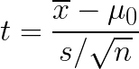
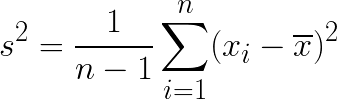
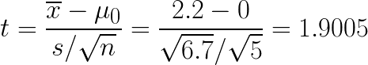

# Frequentist Statistics

* Everyone uses Bayes' Theorem when the the prior *P(H)* is known
* If there is no prior, then we draw inferences from the likelihood function.
* **Frequentist** - the idea that probabilities present long-term frequencies of repeatable random experiments.
  * Don't use probabilities to quantify degree of belief in hypotheses, so no pdf
  * The concepts of probability and randomness should only be used to describe sampling from populations, not degree or certainty of belief.
  * Only repeatable random events have probabilities e.g., coin flips
  * Probability is objective
  * Bayesian: "The probability of average male height being between 70 and 74 inches is 95%" Frequentist: (height is either in this range or it isn't.)[https://www.quora.com/What-is-a-confidence-interval-in-laymans-terms/answer/Michael-Hochster]
* Difference
  * Bayesian statistics will put probability distributions on hypotheses and data. Probability is belief
  * Frequentist statistics will put probability on the experimental data. Probability comes from experiments
* (Another example)[http://www.fharrell.com/post/journey/]
  * A coin is flipped 100 times and it lands heads 60 times.
  * Bayesian: What is the probability of landing more than 60 heads *P(X > 59)*?
  * Frequentist: [Is the coin fair?](http://www.fharrell.com/post/journey/)
  * Bayesian: assign probability to the hypothesis. Frequentist: [test the hypothesis without probability](https://conversionxl.com/blog/bayesian-frequentist-ab-testing/)
  * Bayesian: what is the probability Version A is better than Version B? Frequentist: Is Version A equal to Version B?
* **Point Statistic** - a single value computed from data, such as mean or maximum
* **Interval Statistic** - interval computed from data, such as range
* **Set Statistic** - a set computed from data. Suppose we have bunch of dice, and each dice has different n sides. Data can be the value of the roll of 1 die picked at random. The Set is determined from the value. If it is 20, obviously the 6-sided die is not part of the set.
* **Sampling Distribution** - the probability distribution of the statistic
* **Point Estimate** - using statistics to get paramater *&theta;*

### Errors

* **Type I Error** - reject the null hypothesis but we should not
* **Type II Error** - don't reject the null hypothesis but we should

<table>
  <tr>
    <td colspan='2' rowspan='2'></td>
    <td colspan='2' align='center'>True State of nature</td>
  </tr>
  <tr>
    <td>H0</td>
    <td>HA</td>
  </tr>
  <tr>
    <td rowspan='2'>Decision</td>
    <td>Reject H0</td>
    <td>Type I error</td>
    <td>Correct Decision</td>
  </tr>
  <tr>
    <td>&ldquo;Don&rsquo;t reject &rdquo; H0</td>
    <td>Correct Decision</td>
    <td>Type II error</td>
  </tr>
</table>

### Significance and Power

<table>
  <tr>
    <td><em>P(reject H0|H0)<em></td>
    <td><em>P(reject H0|HA)<em></td>
  </tr>
  <tr>
    <td><em>P(do not reject H0|H0)<em></td>
    <td><em>P(do not reject H0|HA)<em></td>
  </tr>
</table>

* **Significance** - *P(reject H0|H0)* the probability we incorrectly reject H0
  * *P(Type I error)*
  * In other words, the probability the test statistic falls within rejection region even though H0 is true
  * A significance level of 0.05 doe snot mean the test makes mistakes 5% of the time. It means if *H0* is true, then there is a 5% probability that the test will reject it.
* **Power** - *P(reject H0|HA)* the probability that correctly reject H0
 * 1 - *P(Type II error)*
 * Power if *HA* is true, what is the probability of rejecting the null hypothesis?
* Ideally: a hypothesis test should have a small significance level and a high power level
* Example: a new drug vs. placebo
  * *H0* drug is not better than placebo
  * *HA* drug is better than placebo
  * Power - probability that test will say drug is better, if it is truly better
  * Significance - probability tha tthe test wil say drug is better, but it isn't

### Critical Values

* Z
* Probability value is on the other side of *H0*

### *p*-Values

* Assuming the null hypothesis, what is the probability of seeing data at least as extreme as the experimental data.

## Student&rsquo;s *t*-distribution

A student&rsquo;s *t*-distribution is a continuous porbability distribution that comes from a normally-distributed population where the sample size is small and we don&rsquo;t know the standard deviation <em>&sigma;</em>.

* in a *z*-test, the variance of the population data is known.
* *&sigma;* isn't know, then we estimate it from the data

* The test statistic *t* (studentized mean) with a sample variance *s2*
  > 
* variance *s2* is:
  > 
  * The sample variance *s2* is an estimate of the true variance *&sigma2*
  * What&rsquo;s with that <em>n - 1</em>? It&rsquo;s because we don&rsquo;t know the true mean, and so we estimate it; doing so costs 1 degree of freedom. Increasing the amount of unknowns and estimates will raise the variance.
* Null Distribution *f(t|H0)* is the pdf of *T ~ t(n -1)* with *n* - 1 degrees of freedom
  * Right-side *p = P(T > t|H0)*
  * Left-side *p = P(T < t|H0)*
  * 2-Sided *p = P(|T| > t)*
* Given a normal distribution with mean *&mu;* and variance *&sigma;2*
  * let the sample data be [-1, 1, 2, 3, 6]
  * Let *H0 = 0*
  * Let *HA > 0*
  * sample mean *x&#x0304;* = 2.2
  * solving for *s2*  6.7
  > 
  * *p = P(T > t) = P(T > 1.9005) = 0.065

### Confidence Interval

* A range where over many experiments, will cover the true mean n% of the time.
* It is incorrect to say the true mean has a n% chance of falling in the range

## Sources
  * [Are you a Bayesian or a Frequentist?](https://www.behind-the-enemy-lines.com/2008/01/are-you-bayesian-or-frequentist-or.html)

* [Online equation editor](http://www.sciweavers.org/free-online-latex-equation-editor)
  * t: `t = \frac{ \overline{x} - \mu_{0}}{s/\sqrt{n}}`
  * sample variance: `s^{2}=\frac{1}{n-1}\sum_{i=1}^{n}(x_{i}-\overline{x})^2`
* [What is a confidence interval in layman's terms?](https://www.quora.com/What-is-a-confidence-interval-in-laymans-terms/answer/Michael-Hochster)
* (My Journey From Frequentist to Bayesian Statistics)[http://www.fharrell.com/post/journey/]
* [Frequentist And Bayesian Approaches In Statistics](https://www.probabilisticworld.com/frequentist-bayesian-approaches-inferential-statistics/)
* [My Journey From Frequentist to Bayesian Statistics](http://www.fharrell.com/post/journey/)
