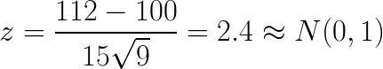

# Hypothesis Testing

* **Hypothesis** - a premise or claim that we want to test.
*
* The null and alternative hypothesis are mathematical opposites. Together, they must allow for all possible answers
* **Neyman-Pearson Paradigm** - If the data is well outside the what is expected under the null hypothesis, then reject the null hypothesis.
* **Difference from Bayesian updating**
  * The evidence of the data will be considered through the likelihood function, not prior beliefs.
  * Need a notion of data considered "extreme," or outside what is expected.
* **Null Hypothesis Significance Testing (NHST)** - compare an observed statistic against a hypothetical distribution aka test distribution
  * **Null Hypothesis (*H0*)** - Currently accepted value for a parameter.
  * **Alternate Hypothesis (*HA*)** - Claim to be tested, aka "research hypothesis"
  * **Test Statistic (*X*)** - is calculated from the sample data, and is used make a decision
  * **Null Distribution** - the probability distribution of *X* assuming *H0*
  * **Rejection Region** - where *X* would be in order to reject *H0* for *HA*
  * **Non-Rejection Region** - where *X* would be in order not to reject *H0* for *HA*
    - "Do not reject" is not the same as "accept!"
  * Example:
    * A candy machine makes chocolate bars that weight 5g on average. A work claims the machine no longer makes 5g bars.
      * *H0*: *&mu; = 5g*
      * *HA*: *&mu; &ne; 5g*
* Example: flip a coin 10 times. Let *&theta;* be the probability that a coin flip lands heads.
  * Null Hypothesis *H0*  - *&theta;* - 0.5, aka "the coin is fair"
  * Alternative Hypothesis *HA* - *&theta;* &ne; 0.5, aka "the coin is rigged"
  * *p*(*x*|*&theta;* = 0.5) ~ *Bin*(10, 0.5) - Binomial distribution
  * **Standardization** - For a random variable *X* that has a normal distribution, the standardization is:
  > 
    * Variance of sum is 10 * 0.52 = 2.5
    * *&sigma;* of sum is 1.15811
  * table for the null distribution

    <table>
      <tr>
        <th><em>x</em></th>
        <th>0</th>
        <th>1</th>
        <th>2</th>
        <th>3</th>
        <th>4</th>
        <th>5</th>
        <th>6</th>
        <th>7</th>
        <th>8</th>
        <th>9</th>
        <th>10</th>
      </tr>
      <tr>
        <td><em>p(x|H0)</em></td>
        <td>0.0010</td>
        <td>0.0098</td>
        <td>0.0439</td>
        <td>0.1172</td>
        <td>0.2051</td>
        <td>0.2461</td>
        <td>0.2051</td>
        <td>0.1172</td>
        <td>0.0439</td>
        <td>0.0098</td>
        <td>0.0010</td>
      </tr>
      <tr>
         <td><em>Z</em></td>
         <td>-3.1623</td>
         <td>-2.5298</td>
         <td>-1.8974</td>
         <td>-1.2649</td>
         <td>-0.6325</td>
         <td>0</td>
         <td>0.6325</td>
         <td>1.2649</td>
         <td>1.8974</td>
         <td>2.5298</td>
         <td>3.1623</td>
      </tr>
      <tr>
        <td><em>p</em></td>
        <td>0.0008</td>
        <td>0.0057</td>
        <td>0.0294</td>
        <td>0.1083</td>
        <td>0.2644</td>
        <td>0.5</td>
        <td>0.2644</td>
        <td>0.1083</td>
        <td>0.0294</td>
        <td>0.0057</td>
        <td>0.0008</td>
    </table>

  * Expected Value of 10 coin flips with 0.5 probability is *E(X) = np* = 10 * 0.5 = 5
  * Reject null hypothesis if heads is extremely fewer or greater than 5. *What counts as 'extremely?'*
* Types of Hypotheses
  * **Simple** - the distribution can be specified
  * **Composite** - the distribution cannot be fully specified

### Innocent until proven guilty

* In hypothesis testing, we assume the null hypothesis is true
  * *H0* - defendant is innocent
  * *HA* - defendant is guilty
  * If evidence proves otherwise, then we will ***reject*** the null hypothesis
  * If there isn't evidence to prove otherwise, then we will ***fail to reject*** the null hypothesis
  * Analogy to US courts: you are presumed to be innocent. It is up to the evidence to prove guilt. You don't have to prove innocence (aka null hypothesis)
* **Statistically significant** - where do we draw the line to make a decision?
* **Confidence Level (*c*)** - how confident are we in our decision?
* **Significance Level (*&alpha; = 1 - c*)** complement to confidence level

### Designing a hypothesis test
  * Pick the null hypothesis *H0*
  * Decide if *HA* is one- or two-sided
    * one-sided: probability that coin favors heads
    * two-sided: probability that coin is not fair
  * Pick a test statistic, e.g., sample mean, sample total
  * pick a significance level *&alpha;*
  * Determine the power

## Tests of population mean

* The test statistic *z* in terms of the sample mean is
  > <!--
    z = \frac{ \overline{x} -  \mu_{0}}{  \sigma/\sqrt{n} } -->
* The test statistic *z* in terms of sample proportion is
  > 
  * where *p0* is the true population proportion and *p* is the hypothesized proportion
* one-tail test

  <table>
    <tr>
      <td><em>P(Z > z)</em></td>
      <td>Z-score</td>
    </tr>
    <tr>
      <td>0.1587</td>
      <td>1.0000</td>
    </tr>
    <tr>
      <td>0.1000</td>
      <td>1.2816</td>
    </tr>
    <tr>
      <td>0.0500</td>
      <td>1.6449</td>
    </tr>
    <tr>
      <td>0.0228</td>
      <td>2.0000</td>
    </tr>
    <tr>
      <td>0.0200</td>
      <td>2.0537</td>
    </tr>
    <tr>
      <td>0.0100</td>
      <td>2.3263</td>
    </tr>
    <tr>
      <td>0.0050</td>
      <td>2.5758</td>
    </tr>
  </table>

* **Lower Tail Test**
  * The hypothesized mean *&mu;o* is less than the true population mean *&mu;*.
  * Reject the null hypothesis if *z &le; -z&alpha;*, where *z&alpha;* is the *100(1 - &alpha;) percentile of the standard normal distribution.
  * Example: A light bulb manufacturer claims its products last more than 10,000 hours. From a sample of 30 bulbs, the average lifetime was 9,900 hours. Assume the standard deviation is 120 hours. Can we reject the manufacturer's claim with a 0.05 (5%) significance level?
    > 
    * The null hypothesis is *&mu; > 10000* since the the claim is at least 10000
    * We know *z*0.05 = 1.645
    * Reject the null hypothesis because -4.564 is less than the critical value of -1.649
* **Upper Tail Test**
  * The hypothesized mean *&mu;o* is greater than the true population mean *&mu;*.
  * Reject the null hypothesis if *z &ge; z&alpha;*.
  * Example: The food label for a bag of cookies says there is at most 2g saturated fat in a single cookie. From a sample of 35 cookies, the average amount of saturated fat is 2.1 grams. Assume the standard deviation of the population is 0.25 grams. Can we reject the null hypothesis with a 0.05 (5%) significance level?
    > 
    * The test statistic of 2.366 means we reject the claim
  * Example: IQ is a N(100, 152) distribution
    * From a sample of 9 students, the average IQ is 112. Can we reject *H0* at a *&alpha;* = 0.05 significance level?
    > 
    * *p = P(Z &ge; 2.4)* = 0.0082
    * Since *p &le; &alpha;* we reject null hypothesis.
  * Example: a population has a mean *&mu;* variance *&theta;2* = 4.
    * let the sample data be [-1, 1, 2, 3, 6]
    * Let *H0 = 0*
    * Let *HA > 0*
    * At *&alpha; = 0.05*, can we reject *H0*?
    * *x&#x0304;* = 2.2. Use *z* test because the data is a normal distribution
    > 
    * *p = P(Z > z) = P(Z > 2.460) = 0.0070 and *z0.05* = 1.645. Reject null hypothesis
* **Two-Tailed Test**
  * The null hypothesis is saying the hypothesized mean is equal to the true mean
  * Reject the null hypothesis if *z &le; -z&alpha;/2* or *z &ge; z&alpha;/2*, where *z&alpha;/2* is the *100(1 - &alpha;/2) percentile of the standard normal distribution.
    * In other words, we have to split the significance level to either side of the distribution curve
  * Example: suppose the average weight of a penguin is 15.4kg. In an sample of 35 penguins, the average penguin weight is 14.6kg, and the population standard deviation is 2.5kg. Can we reject the null hypothesis with a 0.05 significance level?
    > 
    * Since the critical value for *z0.05/2</sub* = *z0.025</sub* = 1.96, the null hypothesis is accepted. We cannot say the weight of the penguins is different
* **Lower Tail Proportion Test**
  * expressed as *p &ge; p0* where *p* is the true population proportion and *p0* is hypothesized lower bound.
  * Example: suppose 60% of citizens voted in the last election. From a telephone survey of 148 people, 85 people said they voted (aka 57%). At a 0.5 significance level, can we reject the null hypothesis that proportion of voters is above 60%?
    > 
    * since *-z0.5* = 1.649, and the test statistic -0.6376 is not less than that, we cannot reject the null hypothesis.
* **Upper Tail Proportion Test**
  * expressed as *p &le; p0* where *p* is the true population proportion and *p0* is hypothesized lower bound.
  * Example: suppose 12% of apples harvested last year were rotten. From this year's sample of 214 apples, 30 are rotten (14%). With a 5% significance level (*&alpha; = 0.05*), can reject the null hypothesis that the proportion of rotten apples is below 12%?
    > 
    * Since the test statistic is not greater than *-z0.5* = 1.649, we cannot reject the null hypothesis.
* **Two-Tailed Proportion Test**
  * expressed as *p = p0* where *p* is the true population proportion and *p0* is hypothesized lower bound.
  * Suppose a coin flip gives 12 heads from 20 flips (60%). At a 0.5 significance level, can we reject the null hypothesis that that the coin toss is fair (50%)?
    > 
    * Since the test statistic falls within then critical values of *-z0.025</sub* = -1.96 and *z0.025</sub* = 1.96, we cannot reject the null hypothesis.

## Two Population proportions

* **Standard Deviation *&sigma;*** - a measure of the variability of a random variable
* **Standard Error** - how precise the estimate is
  * It can be thought of as how precise the mean of the sample is, vs. the true mean of the population
  * increasing the sample size provides a more specific measure of the true *&sigma;*
* Sample Mean
  > 
* Variance of Sample Mean
  > 
* Standard error is square root of variance of sample mean
  > 
  * Note that as the size of the sample *n* increases, the standard error decreases!
* Recall the standard deviation of a binomial distribution
  > 
* Therefore the standard error of sample from a binomial distribution is
  > 
* **Spread** the standard error in the distribution of differences between sample proportions.
  > 
* Difference of means: *p1 - p2*
* We do not have have the true proportions, so we we have to infer *p1* and *p2* from the samples, *p&#x0302;1* and *p&#x0302;2*
  * let *x1* and *x2* be the successes in each of the sample populations. then the **pooled proportion** is:
  > 
* Use the pooled proportion to estimate the standard error
  > 
* Then the Z-test statistic is
  > 
* Since the null hypothesis *H0* says the two proportions should be the same, aka *p&#x0302;1* - *p&#x0302;2* = 0, we can simplify to
  > 

### Example

* the BigBoxRetail company has been accused of not properly giving their employees health insurance.
  * The claim is only 46% of employees at BigBoxRetail have health insurance, vs. the standard Retail Company average of 66% coverage.
  * From a sample of 50 employees at BigBoxRetail, 23 are covered.
  * From a sample of 70 employees at other Retail companies, 23 are covered.
  * Do employees at BigBoxRetail have less coverage, with 5% level of significance (*&alpha;* = 0.05)?
  * Calculate Test statistic
    > 
  * Calculate pooled proportion
  > 
  * Calculate standard error
  > 
  * Calculate Z-score
  > 
  * *p*-value: *P(Z < -1.6749)* &approx; 0.0470 or 4.7%
  * Analysis: If the *H0 is true, then there is a 4.7% chance that that the difference of means is less than 0.1543. This is unlikely with *&alpha;* = 0.05

## Sources:

* [Hypothesis Testing, R Tutorial](http://www.r-tutor.com/elementary-statistics/hypothesis-testing)
* [HTML Math Symbols, Math Entities, and ASCII Math Character Code Reference](https://www.toptal.com/designers/htmlarrows/math/)
* [Online equation editor](http://www.sciweavers.org/free-online-latex-equation-editor)
  * proportion: `z = \frac{ \overline{p} - p_{0}}{   \sqrt{p_{0}(1 - p_{0})/n}  }`
  * Sampling Standard Deviation: `\sigma_{ \overline{x} } =  \frac{ \sigma }{ \sqrt{n} }`
  * Light bulb example: `\frac{9900 - 10000}{120 /  \sqrt{30} } = -4.456`
  * cookie example: `\frac{2.1 - 2}{0.25 /  \sqrt{35} } = 2.366`
  * IQ example: `z = \frac{112 - 100}{15\sqrt{9}} = 2.4 \approx N(0,1)`
  * Upper data example: `z = \frac{\overline{x} - \mu_{0}}{\sigma/\sqrt{n}} = \frac{2.2 - 0}{2/\sqrt{5}} = 2.2497`
  * Penguin example: `\frac{15.4 - 14.6}{2.5 /  \sqrt{35} } = 1.893`
  * voter example: `\frac{ \frac{85}{148} - 0.6}{   \sqrt{0.6(1 - 0.6)/148}  } =  \frac{  0.57\overline{432} - 0.6}{   \sqrt{0.6 * 0.4/148}  } = -0.638`
  * apple example: `\frac{ \frac{30}{214} - 0.12}{   \sqrt{0.12(1 - 0.12)/214}  } =  \frac{  0.1402 - 0.12}{   \sqrt{0.12 * 0.88/214}  } = 0.909`
  * coin flip example: `\frac{ \frac{12}{20} - 0.5}{   \sqrt{0.5(1 - 0.5)/20}  } =  \frac{  0.6 - 0.5}{   \sqrt{0.25/20}  } = 0.894`
  * sample mean - `\overline{X} = \frac{1}{n}\sum_{i=1}^{n}X_{i}`
  * sample Variance - `Var(\overline{X}) = Var\left ( \frac{1}{n}\sum_{i=1}^{n}X_{i} \right )  = \frac{\sigma^{2}}{n}`
  * standard error: `\sigma^{\overline{X}} = \frac{\sigma}{ \sqrt{n} }`
  * Bernoulli Standard Deviation: `\sigma =  \sqrt{p(1-p)}`
  * binomial standard error: ` \sigma^{\overline{X}} =\sqrt{\frac{p(1-p)}{n}}`
  * standard error difference: `\sqrt{\frac{p_1(1-p_1)}{n_1}+\frac{p_2(1-p_2)}{n_2}}`
  * pooled proportion: `\widehat{p} = \frac{x_1+x_2}{n_1+n_2} `
  * pooled standard error: `\sqrt{\frac{\widehat{p}(1-\widehat{p})}{n_1}+\frac{\widehat{p}(1-\widehat{p})}{n_2}}`
  * z-test 2 populations: `Z= \frac{X - \mu}{\sigma} = \frac{(\widehat{p}_1-\widehat{p}_2) - (p_1-p_2)}{\sqrt{\frac{\widehat{p}(1-\widehat{p})}{n_1}+\frac{\widehat{p}(1-\widehat{p})}{n_2}}}  `
  * z-test 2 population simplified: `Z= \frac{\widehat{p}_1-\widehat{p}_2}{\sqrt{\widehat{p}(1-\widehat{p}) \left ( \frac{1}{n_1} + \frac{1}{n_2} \right )  }}`
  * retail example:
    * pooled proportion: `\widehat{p} = \frac{x_1+x_2}{n_1+n_2} = \frac{23+43}{50+70} = 0.55`
    * test statistic: `X = \widehat{p}_1-\widehat{p}_2 = \frac{23}{50}-\frac{43}{70} \approx -0.1543`
    * stadard error: `\sigma = \sqrt{0.55*0.45 \left ( \frac{1}{50} + \frac{1}{70} \right ) } \approx 0.0921`
    * z-score: `Z = \frac{-0.1543}{0.0921} \approx -1.6749`
* [Intro to Hypothesis testing in Statistics](https://www.youtube.com/watch?v=VK-rnA3-41c)
* [Hypothesis testing and p-values](https://www.youtube.com/watch?v=-FtlH4svqx4)
* [Introductin to Hypothesis testing](https://www.youtube.com/watch?v=qsMZ4Zi5Csk)
* [Null Hypothesis Significance Testing I](https://ocw.mit.edu/courses/mathematics/18-05-introduction-to-probability-and-statistics-spring-2014/readings/MIT18_05S14_Reading17b.pdf)
* [What is the difference between the standard error of the mean and standard deviation?](https://www.investopedia.com/ask/answers/042415/what-difference-between-standard-error-means-and-standard-deviation.asp)
* [Standard deviation versus standard error](http://thestatsgeek.com/2013/06/30/standard-deviation-versus-standard-error/)
* [Hypothesis Test for Difference in Two Population Proportions](https://courses.lumenlearning.com/wmopen-concepts-statistics/chapter/hypothesis-test-for-difference-in-two-population-proportions-3-of-6/)
