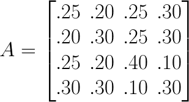
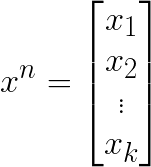
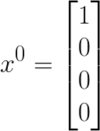
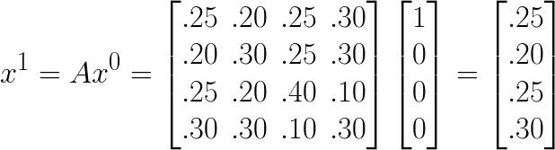
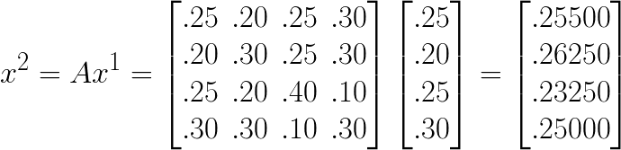
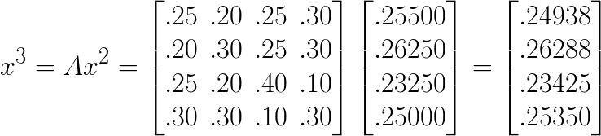
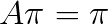
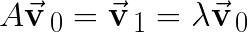
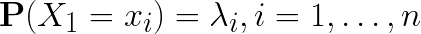
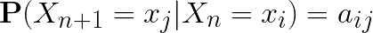

# Markov Chains

## Define Transition and Stochastic Matrices

* [Suppose in a small town there are three restaurants](https://www.math.ucdavis.edu/~daddel/linear_algebra_appl/Applications/MarkovChain/MarkovChain_9_18/node1.html). For dinner, people have the option of staying at home, the Chinese or Mexican restaurant, or eating at the pizzeria. In other words, on any given night, a household does only 1 of 4 dining options
  * If a household eats at home, then on the next day they have a 20% chance eating Chinese, 25% Mexican, and 30% pizzeria.
  * If a household eats at the Chinese restaurant, they have a 25% chance of staying home the next night, 25% chance Mexican, and 30% pizzeria.
  * If a household eats at a Mexican restaurant, they will eat at home 25% of the time on the next night, 20% Chinese, and 10% pizzeria.
  * If a household eats at the pizzeria, on the next night they have a 30% chance of staying at home for dinner, 30% Chinese, and 10% Mexican.
* After a very long period of time, what is the percentage of households who go to the pizzeria for dinner?
* <strong>[Markov Chain](https://www.math.ucdavis.edu/~daddel/linear_algebra_appl/Applications/MarkovChain/MarkovChain_9_18/node1.html)</strong>
  * There is a physical or mathematical system that has <strong><em>k</em></strong> possible states.
  * At any one time, the system is in one and only one of those <strong><em>k</em></strong> states.
  * For any observation at the <strong><em>n<sup>x</sup></em></strong> period, the probability of the system being in some state only depends on which state the system was in during the <strong><em>n<sup>x-1</sup></em></strong> period.
* For the restaurant example, there are are only <strong><em>k = 4</em></strong> states.
* Let <strong><em>a<sub>ij</sub></em></strong> be the probability of the system to be in state <strong><em>i</em></strong> after it was in state <strong><em>j</em></strong>
* <strong>Transition Matrix</strong> of the Markov Chain - a matrix <strong><em>A = (a<sub>ij</sub>)</em></strong>
  > <!--
    A =
    \begin{bmatrix}
    .25 & .20 & .25 & .30 \\
    .20 & .30 & .25 & .30 \\
    .25 & .20 & .40 & .10 \\
    .30 & .30 & .10 & .30
    \end{bmatrix}
    -->
* Or represented as a table

<table>
  <tr>
    <td colspan="2" rowspan="2"></td>
    <td colspan="4" align="center">Tomorrow night</td>
  </tr>
  <tr>
    <td>Home</td>
    <td>Chinese</td>
    <td>Mexican</td>
    <td>Pizzeria</td>
  </tr>
  <tr>
    <td rowspan="4" valign="middle">Tonight</td>
    <td>Home</td>
    <td>.25</td>
    <td>.20</td>
    <td>.25</td>
    <td>.30</td>
  </tr>
  <tr>
    <td>Chinese</td>
    <td>.20</td>
    <td>.30</td>
    <td>.25</td>
    <td>.30</td>
  </tr>
  <tr>
    <td>Mexican</td>
    <td>.25</td>
    <td>.20</td>
    <td>.40</td>
    <td>.10</td>
  </tr>
  <tr>
    <td>Pizzeria</td>
    <td>.30</td>
    <td>.30</td>
    <td>.10</td>
    <td>.30</td>
  </tr>
</table>

* <strong>[Stochastic Matrix](https://en.wikipedia.org/wiki/Stochastic_matrix)</strong> - a square matrix where:
  * <strong>Right Stochastic</strong> - the sum of each row is 1
  * <strong>Left Stochastic</strong> - the sum of each column is 1
  * <strong>Doubly Stochastic</strong> - sums of rows and columns add up to 1

## Solving for the System

* What is the probability of the system being in the <strong><em>i<sup>th</sup></em></strong> state at the <strong><em>n<sup>th</sup></em></strong> observation?
* <strong>State Vector</strong> - a <strong><em>1 &times; k</em></strong> matrix for the observation period <strong><em>n</em></strong> where <strong><em>x<sub>i</sub></em></strong> represents the probability the system in the <strong><em>i<sup>th</sup></em></strong> state.
  > <!--
    x^{n} = \begin{bmatrix} x_1 \\ x_2 \\ \vdots \\ x_k \end{bmatrix}
    -->
  * The sum of all the values in the state ector has to be 1.
* Since the point of a Markov chain is that over many observations the probability of being in any state is independent of where you started, let the initial state be at home for the above example.
  > <!--
    x^{0} = \begin{bmatrix} 1 \\ 0 \\ 0\\ 0 \end{bmatrix}
    -->
* Given this initial state, what are the probabilites of dining choice the next night?
  > <!--
    {x^1 = Ax^0 =
    \begin{bmatrix}
    .25 & .20 & .25 & .30 \\
    .20 & .30 & .25 & .30 \\
    .25 & .20 & .40 & .10 \\
    .30 & .30 & .10 & .30
    \end{bmatrix}
    \begin{bmatrix} 1 \\ 0 \\ 0\\ 0 \end{bmatrix} =
    \begin{bmatrix} .25 \\ .20 \\ .25\\ .30 \end{bmatrix}}
    -->
* And the next night?
  > <!--
    {x^2 = Ax^1 =
    \begin{bmatrix}
    .25 & .20 & .25 & .30 \\
    .20 & .30 & .25 & .30 \\
    .25 & .20 & .40 & .10 \\
    .30 & .30 & .10 & .30
    \end{bmatrix}
    \begin{bmatrix} .25 \\ .20 \\ .25\\ .30 \end{bmatrix} =
    \begin{bmatrix} .25500 \\ .26250 \\ .23250 \\ .25000 \end{bmatrix}}
    -->
* And on the third night?
  > <!--
    {x^3 = Ax^2 =
    \begin{bmatrix}
    .25 & .20 & .25 & .30 \\
    .20 & .30 & .25 & .30 \\
    .25 & .20 & .40 & .10 \\
    .30 & .30 & .10 & .30
    \end{bmatrix}
    \begin{bmatrix} .25500 \\ .26250 \\ .23250 \\ .25000 \end{bmatrix} =
    \begin{bmatrix} .24938 \\ .26288 \\ .23425 \\ .25350 \end{bmatrix}}
    -->

## Eigenvalues and Eigenvectors

* Notice that for the state vectors above, every subsequent night begins to become closer and closer in value to the previous state vector?
  * <strong>[Stationary Transition](https://www.mcmchandbook.net/HandbookChapter1.pdf)</strong> - if we know the probability of being in state <strong><em>n<sup>x+1</sup></em></strong>, given state <strong><em>n<sup>x</sup></em></strong>, a Markov chain will have stationary property if the value of n does not matter. In other words, over a very long period of time after many transitions, the probabilities of each state will settle.
* <strong>Stationary Distribution</strong> - let <strong><em>A</em></strong> be an <strong><em>n &times; n</em></strong> Markov matrix and let <strong><em>&pi;</em></strong> be a <strong><em>n &times; 1</em></strong> vector such that
  > <!--
    A\pi = \pi
    -->
  * Then <strong><em>&pi;</em></strong> is the stationary distribution.
* [When multiplying matrices](http://tutorial.math.lamar.edu/Classes/DE/LA_Eigen.aspx), we know that a <strong><em>n &times; n</em></strong> matrix times a <strong><em>n &times; 1</em></strong> matrix will yield some other <strong><em>n &times; 1</em></strong> matrix, which will be different from the original <strong><em>n &times; 1</em></strong> by a factor <strong><em>&lambda;</em></strong>
  > <!--
    A\vec{\mathbf{v}}_{\,0} = \vec{\mathbf{v}}_{\,1} = \lambda\vec{\mathbf{v}}_{\,0}
    -->
  * <strong>Eigenvalue</strong> - the value of <strong><em>&lambda;</em></strong>
  * <strong>Eigenvector</strong> - the value of <strong><em>v<sub>0</sub></em></strong>
* In the case of a Markov Chain&rsquo;s stationary distribution, the stationary distribution itself is the eigenvector when the eigenvalue is equal to 1.
* full code and comments in [scipy-stationary-distribution.py](./libraries/scipy-examples/cipy-stationary-distribution.py).
```python
import numpy as np
import scipy.sparse.linalg as sla

transition_matrix = [
    [.25, .20, .25, .30],
    [.20, .30, .25, .30],
    [.25, .20, .40, .10],
    [.30, .30, .10, .30]
]

eigenvalue, eigenvector = sla.eigs(np.array(transition_matrix), k=1, which='LM')
stationary_distribution = (eigenvector/eigenvector.sum()).real

# output: [[0.2494929], [0.26335362], [0.23394185], [0.25321163]]
print(stationary_distribution)
```

### Finite and Infinite spaces

* <strong>Finite</strong> - -ike the restaurant example if we know all the states and it is countable.
  * The state space can be expressed as <strong><em>{x<sub>1</sub>,&hellip;,x<sub>n</sub>}</strong>
  * Let the initial distribution or initial vector be <strong><em>&lambda; = \[&lambda;<sub>1</sub>,&hellip;,&lambda;<sub>n</sub>\]</strong>
    > <!--
      {\mathbf{P}(X_1=x_i) = \lambda_i, i = 1,\ldots,n}
      -->
  * let <strong><em>i</em></strong> be some state and let <strong><em>j</em></strong> be the <strong><em>i + 1</em></strong> state. Then for a matrix <strong><em>A</em></strong>
    > <!--
      {\mathbf{P}(X_{n+1}=x_j|X_n=x_i) = a_{ij}}
      -->

### More MCMC properties

* <strong>Stochastic Process</strong> - thought if in a different way, it is a system of random events that occur in a sequence over time.
* <strong>Stationarity</strong> - a stochastic process is stationary if over a suffiently long period of time, the state <strong><em>x<sub>n + k</sub></em></strong> does not depend on the value of <strong><em>n</em></strong> (i.e., it doesn&rsquo;t matter where you started)
* <strong>Reversible</strong> - if the probability of going from one state to another state is the same as going from the second state to the first state. A system that is reversible implies that it is has stationarity, but not vice versa. Systems that are reversible are easier to deal with.
* <strong>Functional</strong> - if <strong><em>X<sub>1</sub>, X<sub>2</sub>, &hellip;</em></strong> is a stochastic process, and there is some function <strong><em>g</em></strong> such that <strong><em>g(X<sub>1</sub>), g(X<sub>2</sub>), &hellip;</em></strong> is a stochastic process too.
  * However, <strong><em>g(X<sub>1</sub>), g(X<sub>2</sub>), &hellip;</em></strong> is usually not a Markov chain because the distribution of <strong><em>g(X<sub>n+1</sub>)</em></strong> given <strong><em>g(X<sub>1</sub>), g(X<sub>2</sub>), &hellip;</em></strong> does not depend only on <strong><em>g(X<sub>n</sub>)</em></strong>

## OMC - Ordinary Monte Carlo

* AKA &ldquo;Independent and identically distributed (IID) Monte Carlo&rdquo; - a special case of MCMC where <strong><em>X<sub>1</sub>, X<sub>2</sub>, &hellip;</em></strong> are independent (the next state has no memory of the current state), so the Markov Chain is reversible and stationary.

 

## Sources

* [Markov Chains](https://www.math.ucdavis.edu/~daddel/linear_algebra_appl/Applications/MarkovChain/MarkovChain_9_18/node1.html)
* [scipy.sparse.linalg.eigs](https://docs.scipy.org/doc/scipy/reference/generated/scipy.sparse.linalg.eigs.html) scipy documentation
* [find Markov steady state with left eigenvalues (using numpy or scipy)
](https://stackoverflow.com/questions/33385763/)
* [Section 5-3 : Review : Eigenvalues & Eigenvectors](http://tutorial.math.lamar.edu/Classes/DE/LA_Eigen.aspx)
* [Stocastic Matrix](https://en.wikipedia.org/wiki/Stochastic_matrix) (Wikipedia)
