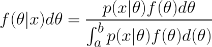
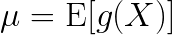
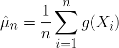
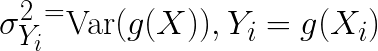
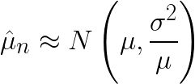
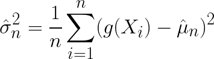
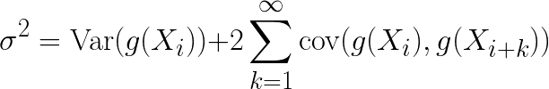
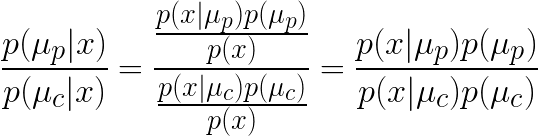
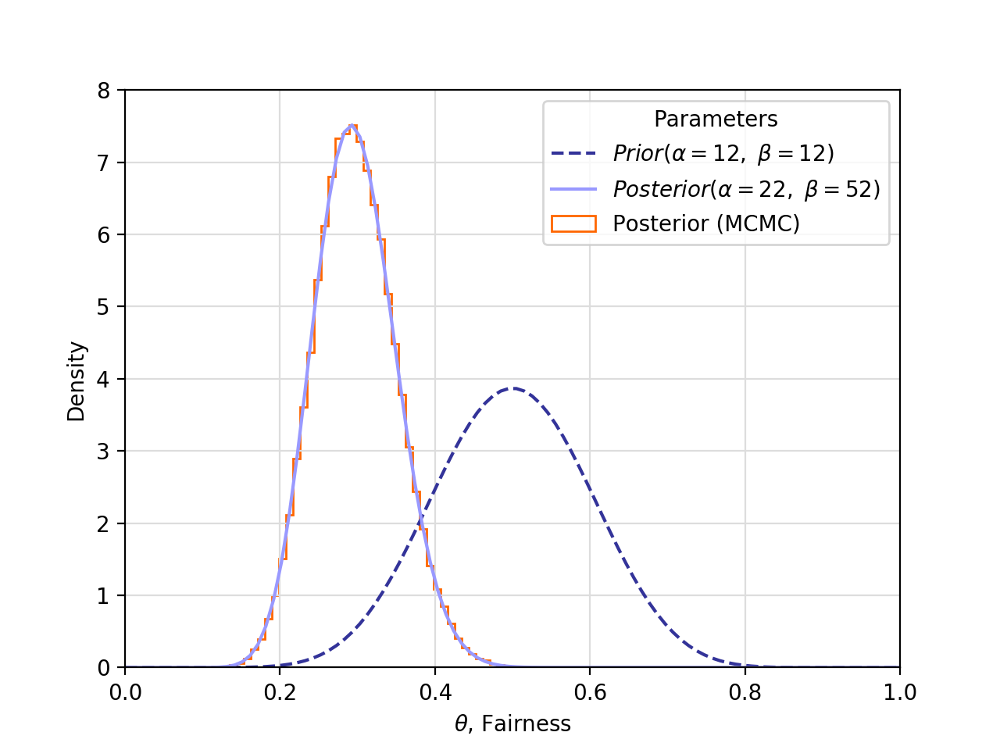

# Markov Chain Monte Carlo (MCMC)

## What is the point?

* It's easy when the likelihood function is a binomial distribution and the prior is a Beta distibution. The posterior is also a Beta distribution. The prior is a <strong>conjugate prior</strong>
* Not all models can use conjugate priors, so calculating the posterior will have to approximated.
  * Example: <strong>Bayesian Hierachal Modeling</strong> - a statistical model with multiple levels and is basically intractable using analytical methods
* <strong>Markov Chain Monte Carlo (MCMC)</strong> - a family of algorithms that help approximate the posterior distribution from Bayesian Statistics.
* Recall Bayes&rsquo; Theorem for continuous priors:
  > <!--
    {f(\theta|x)d\theta =
    \frac{p(x|\theta)f(\theta)d\theta}{\int_a^b p(x|\theta)f(\theta)d(\theta)}}
    -->
  * Sometimes it&rsquo;s too difficult to solve for the denominator.
* If a model has many parameters, integrals will have to be solved over multiple dimensions, which leads to:
  * <strong>Curse of Dimensionality</strong> - as integral dimensions increase, the volume space becomes so vast that any data becomes insignificant, e.g., we would need a whole lot more data.
* [Use MCMC methods to approximate the posterior distribution](A Zero-Math Introduction to Markov Chain Monte Carlo Methods) of a parameter by random sampling in a probablistic space
  * <em>Parameter</em> - the value of the probability of something happening
  * <em>Distribution</em> - a mathematical representation of every possible value of the parameter and how likely they are, i.e., a probability of probabilties
  * In Bayesian terminology, it describes our beliefs about the parameter.


### [Monopoly as MCMC](https://stats.stackexchange.com/q/12680)

* Imagine all properties of a Monoply board game as different possible states.
* When transitioning to any other probability, you have various probabilities of moving around based on your dice rolls.
* Eventually, it is possible to return to where you start. Also if your monopoly game lasts forever, the probability of being on any property won't depend on where you started.
* Now, instead of rolling dice, create some program which simulates random numbers and you move around the board based on your results.
* The monopoly board = Markov Chain
* The simulated dice rolls: Markov Chain

### Why not just a ton of Monte Carlo simulations and skip the Markov chain?

* Ultimately, the goal is to find the area under a tricky curve (i.e., integrate complicated posterior distribution). We could theoretically generate a million values and just find the ratio of samples that lie under versus above the curve.
* The way MCMC would work is to generate a value, and then generate another value.
  * Based on the probability of the new value occurring, then accept it if is more likely to occur than the previous value, or rejected it (the exact criteria of acceptance or rejection is based on the specific algorithm), and continue to generate new values.
  * (If rejected, generate a new value and compare that value to the last accepted value.)
  * This process will approximate the curve and we won't have to generate as many values as a plain Monte Carlo system.
  * This process of acceptance/rejection [makes it a Markov Chain]((https://stats.stackexchange.com/q/108)) because we are only evaluating the current state/value, and comparing it to the next state/value.

### [As code](https://www.mcmchandbook.net/HandbookChapter1.pdf)

If <strong><em>x</em></strong> is entire state of the below computer program (ignoring the thing that generates the random numbers) then it would be MCMC

```
Initialize x
repeat {
    Generate pseudorandom change to x
    Output x
}
```


### Functionals

* <strong>Functional</strong> - if <strong><em>X<sub>1</sub>, X<sub>2</sub>, &hellip;</em></strong> is a stochastic process, and there is some function <strong><em>g</em></strong> such that <strong><em>g(X<sub>1</sub>), g(X<sub>2</sub>), &hellip;</em></strong> is a stochastic process too.
  * However, <strong><em>g(X<sub>1</sub>), g(X<sub>2</sub>), &hellip;</em></strong> is usually not a Markov chain because the distribution of <strong><em>g(X<sub>n+1</sub>)</em></strong> given <strong><em>g(X<sub>1</sub>), g(X<sub>2</sub>), &hellip;</em></strong> does not depend only on <strong><em>g(X<sub>n</sub>)</em></strong>

## OMC - Ordinary Monte Carlo

* AKA &ldquo;Independent and identically distributed (IID) Monte Carlo&rdquo; - a special case of MCMC where <strong><em>X<sub>1</sub>, X<sub>2</sub>, &hellip;</em></strong> are independent (the next state has no memory of the current state), so the Markov Chain is reversible and stationary.
  * let <strong><em>g</em></strong> be a real-value function, but it is too hard o solve using summation or integration.
    * This is just an expectation because cannot be known in practice. It can only be approximated via Monte Carlo
  > <!--
    \mu = \mathrm{E}[g(X)]
    -->
  * The formula below is the <strong>Monte Carlo Approximation</strong> a.k.a., Monte Carlo calculation of <strong><em>&mu;</em></strong>.
    * It is not a point estimate because in computer simulations are always pseudo-random, not true random.
    * Let <strong><em>n</em></strong> be the <em>Monte Carlo sample size</em>
  > <!--
    \hat{\mu}_n = \frac{1}{n}\sum_{i=1}^{n}g(X_i)
    -->
  * Let <strong><em>Y<sub>i</sub> - g(X<sub>i</sub>)</em></strong>. Then <strong><em>Y<sub>i</sub></em></strong> are also independent and identically distributed. The mean and variance:
  > <!--
    \sigma^2_{Y_i}^ = \mathrm{Var}(g(X)), Y_i = g(X_i)
    -->
  * Since drawing a groups of samples follows the central limit theorem, the mean of the samples is normally distributed.
  > <!--
    \hat{\mu}_n \approx N \left(\mu, \frac{\sigma^2}{\mu} \right)
    -->
  * The variance:
  > <!--
    \hat{\sigma}^2_n = \frac{1}{n}\sum_{i=1}^{n}(g(X_i)-\hat{\mu}_n)^2
    -->
    * And the Monte Carlo Standard Error (MCSE) is equal to the standard deviation divided by the square root of the Monte Carlo sample size.
* Properties of OMC:
  * <strong>Square root law</strong> - the accuracy is inversely proportional to the square root of the sample size. In other words, increasing accuracy 10 times (one more decimal place) requires 100 times the number of samples.

### From OMC to MCMC

* When going to MCMC, the standard error changes because there is stochastic dependence, e.g., the next state depends on the curren state. Then the variance for a stationary Markov Chain is
  > <!--
    {\sigma^2 = \mathrm{Var}(g(X_i)) +
    2 \sum_{k=1}^{\infty} \mathrm{cov}(g(X_i),g(X_{i+k}))}
    -->
  * (It is very, very hard to calculate the above.)
* However, MCMC does not use stationary Markov Chains because if you can simulate <strong><em>X<sub>i</sub></em></strong>, then you could just simulate <strong><em>X<sub>1</sub>, X<sub>2</sub>, &hellip;</em></strong> with regular OMC.
* [Develop this further. The theory for now is beyond my capabilities](https://www.mcmchandbook.net/HandbookChapter1.pdf)

## Finally maybe some code?

* Let `mc_current` be the starting parameter <strong><em>&mu;</em></strong> position.
* Propose a jump (i.e., Markov Chain) to a new position
* The <strong>Metropolis</strong> sampler - take a sample from a normal distribution centered at `mc_current` with a standard deviation defined as `proposed_width` which defines how far the jumps go.

```python
from scipy.stats import norm

mu_current = 1
proposal_width

proposal = norm(mu_current, proposal_width).rvs()
```

* Does the `proposal` describe the data better than `mu_current`? Then accept
* <strong>Describe the data better</strong> - compute the data, given the likelihood with the proposed parameter values

```python
likelihood_current = norm(mu_current, 1).pdf(data).prod()
likelihood_proposal = norm(mu_proposal, 1).pdf(data).prod()

# Prior probability of current mean μ
prior_current = norm(mu_prior_mu, mu_prior_sd).pdf(mu_current)
# Prior probability of proposed mean μ
prior_proposal = norm(mu_prior_mu, mu_prior_sd).pdf(mu_proposal)

# Bayes nominator of current posterior probability of mean μ
p_current = likelihood_current * prior_current
# Bayes nominator of proposed posterior probability of mean μ
p_proposal = likelihood_proposal * prior_proposal
```

* The acceptance probability is the nominator of the proposed posterior divided by the nominator of the current posterior.

```python
p_accept = p_proposal / p_current
```

* How does above work (i.e., why only divide the nominators?) Let <strong><em>&mu;<sub>p</sub></em></strong> be the proposed mean and let <strong><em>&mu;<sub>p</sub></em></strong> be the current mean
  > <!--
    {\frac{p(\mu_p|x)}{p(\mu_c|x)} =
    \frac{\frac{p(x|\mu_p)p(\mu_p)}{p(x)}}{\frac{p(x|\mu_c)p(\mu_c)}{p(x)}} =
    \frac{p(x|\mu_p)p(\mu_p)}{p(x|\mu_c)p(\mu_c)} }
    -->
  * By dividing the proposed posterior by the current posterior, the denominators cancel out.
* However, this isn&rsquo;t enough because the only acceptable jumps would be those that go closer to the the mean.
* Generate a uniform random number <strong><em>v &isin; [0,1]</em></strong> If this number is contained within the the interval <strong><em>[0,p_accept]</em></strong> then accept the jump.

```python
accept = np.random.rand() < p_accept

if accept():
  cur_pos = proposal
```

### [Metropolis Algorithm Rephrased](https://www.quantstart.com/articles/Markov-Chain-Monte-Carlo-for-Bayesian-Inference-The-Metropolis-Algorithm)

1. Begin the algorithm at the current position <strong><em>&theta;<sub>c</sub></em></strong>
1. Propose a &ldquo;jump&rdquo; to a new position <strong><em>&theta;<sub>p</sub></em></strong>
   * The proposal to jump is based on a normal distribution with mean and standard deviation
   * Use normal distibution it is more likely to choose jumps that are closer to current position than farther away.
   * The <em>&ldquo;Proposal Width&rdquo;</em> is the value of the standard deviation
   * A wide proposal width covers space in the posterior distribution quicker, but might initially miss the region of higher probability.
   * A narrow proposal width could take longer to converge
1. Accept or reject the jump using a probability function based on the prior distribution and data
   * Calculate the ratio of the posterior distribution at the new position versus the the posterior distribution at the current position
   * Generate a uniform random number <strong><em>&isin; [0,1]</em></strong>. If the number is within the space of the ratio, accept the jump, otherwise reject.
1. If accepted, jump to new position and return to step 1
1. If rejected, maintin current position and return to step 1
1. After some number of jumps occurred, return all accepted positions.

### Simple MCMC with Beta

* A prior beta distribution of a fair coin with <strong><em>&mu; = 0.5</em></strong> and <strong><em>&sigma; = 0.1</em></strong> is a <strong><em>Beta(12, 12)</em></strong> distribution. See [docs/beta.md](./beta.md) for more info on getting beta from <strong><em>&mu;</em></strong> and <strong><em>&sigma;</em></strong>
* Let the data be 10 heads out of 50 coin clips (i.e., 40 tails). Then the posterior is <strong><em>Beta(22, 52)</em></strong>

```python
beta_distributions = [
    {'alpha': 12, 'beta': 12, 'linestyle': '--', 'color': '#9999FF'},
    {'alpha': 22, 'beta': 52, 'linestyle': '-', 'color': '#000099'}
]
```

* In this case, obtaining the posterior is relatively easy. So let's do it with `PyMC3` to confirm it works.
* Establish prior parameters and data:

```python
import matplotlib.pyplot as plt
import numpy as np
import pymc3
import scipy.stats as stats

# Parameter values for prior and analytic posterior
n = 50
z = 10
alpha_prior = 12
beta_prior = 12
alpha_posterior = alpha_prior + z
beta_posterior = beta_prior + n - z

# number of iterations of Metropolis algorithm for MCMC
iterations = 100000
```

* `PyMC3` uses a with context to assign all the parameters to a `pymc3.Model` instance, which in this case is named `basic_model`

```python
basic_model = pymc3.Model()
with basic_model:
    # Let theta be the parameter to be determined by the prior distribution
    theta = pymc3.Beta('theta', alpha=alpha_prior, beta=beta_prior)

    # Define the Binomial likelihood with n trials p theta parameter
    y = pymc3.Binomial('y', n=trials, p=theta, observed=successes)

    # define a place to start sampling
    start = pymc3.sample()

    # Use the Metropolis algorithm (as opposed to NUTS or HMC, etc.)
    jump = pymc3.Metropolis()

    # Calculate the trace. Samples are stored here
    trace = pymc3.sample(iterations, jump, start, random_seed=1, progressbar=True)
```

<p align="center">
  
</p>

* Plot the posterior as a histogram

```python
plt.hist(
    trace['theta'],
    50, # number of bins
    histtype='step',
    normed=True,
    label='Posterior (MCMC)'
)
```

### Algorithms

#### Metropolis Hastings

This is the simplest MCMC algorithm. The system makes a random proposal for new values, and then accepts or rejects the proposal. Eventually over time, the distribution of accepted proposals approximates the posterior distribution. The problem with this algorithm is that is inefficent. It makes a lot of rejected proposals


<!--

## Non-math introduction (approach #1)


### Height example:

* Suppose we believe the average height of a human follows a normal distribution with a mean <strong>&mu;</strong>=74 inches. This is the <em>prior distribution</em>.
* Supposed we collected data, and observed a range of heights between 60 - 72 inches. If the data can be represented as a curve of what the average human height might be, then it is the <em>likelihood distribution</em>*
* Combine the prior and likelihood to get the <em>posterior distribution</em>.
* But what if the prior and likelihood aren't easy bell curve


### Markov Chain

* <strong>Markov Chain</strong> - sequences of events that are probabilistically related to each other.
  * Each event comes from a set of outcomes
  * Each outcome determines which outcome occurs next
  * Each outcome occurs according to a set of probabilties
* <strong>Memoryless</strong> - everything you need to know to predict the next outcome can be determined by looking at the current state. The history of events provides no new information.
* Although the first few characters appear as if they were determined by where you started, the distribution of outcomes will eventually settle into a pattern.
* Interdependent events, if confined to probabilities, will eventually conform to an average.

### combine the two

* MCMC method picks a random parameter value to begin.
* Next, generate a random value.
* If that randomly generated value is more likely to explain the data, given prior beliefs, then it is added to the chain of parameter values, with a certain probability based on how much better.
* Over time, generate a histogram over which values occur most, and that histogram will approximate the posterior distribution.

-->


<!--
## Non-bullshit explanation (approach #2)

* [MCMC attempts to draw from a distribution efficiently](https://jeremykun.com/2015/04/06/markov-chain-monte-carlo-without-all-the-bullshit/).
* Suppose there is a black box which estimates the probablity of what baby name you will choose for your child.
  * Pick a name randomly and the black box will give you the probability of you choosing that name for your child.
  * Some names will have higher probability of being the chosen name, some names will have very very low probablity of being the chosen name.
  * Suppose the process of choosing names randomly was a uniform process. Then the generating of names is very inefficient.
* Suppose there is a finite set <em>X</em> and suppose there is a distribution <em>D</em> over that set.
  * There a black box that will give the probability function <em>p(x)</em> which gives the probability of drawing <em>x &isin; X</em> according to <em>D</em>
  * Create an efficient algorithm <em>A</em> that generates an element within the set X so that the probability of getting <em>x</em> is approximately <em>p(x)</em>*
  * In other words, generate random values that are more likely to occur according its chances of occurring.
* Suppose the weather is either sunny, rainy, or cloudy.
  * If today is sunny, then the probability of tomorrow being sunny is 70%, cloudy 20%, and rainy 10%. For all other days, see the matrix below:
<table>
  <thead>
    <tr>
      <th></th>
      <th>Sunny</th>
      <th>Cloudy</th>
      <th>Rainy</th>
    </tr>
  </thead>
  <tbody>
    <tr>
      <td>Sunny</td>
      <td>0.7</td>
      <td>0.2</td>
      <td>0.1</td>
    </tr>
    <tr>
      <td>Cloudy</td>
      <td>0.2</td>
      <td>0.6</td>
      <td>0.2</td>
    </tr>
    <tr>
      <td>Rainy</td>
      <td>0.3</td>
      <td>0.3</td>
      <td>0.4</td>
    </tr>
  </tbody>
</table>
  * Imagine these probabilities as a graph, where the weather is vertex and the connections between weather are edges
  * <strong>State</strong> - what the weather is on a certain day, i.e., the vertex.
  * <strong>Stationary Distribution<strong> - Let the day-to-day weather patterns happen over a very long period of time. Then the probability of weather type on a day in the distant future is independent of the weather today.
  * For a Markov chain to work:
    * The graph must be <strong>connected</strong> - there is a path from every vertex to every other vertex
    * The graph must be <strong>Strongly connected</strong> - there is a path from every vertext to every other vertex when considering direction
    * <strong>Persistence</strong> - Hence, over time, the probability of returning to where you started is 1.
    * <strong>Aperiodic</strong> - regardless of where you start, the probability of being at any state is positive. A non-aperiodic system is where the probability of being at any state is positive every other step.

* This one has Python code to do multivariate testing with Markov Chain Monte Carlo. Definitely worth studying [A/B Testing with Hierarchical Models in Python](https://blog.dominodatalab.com/ab-testing-with-hierarchical-models-in-python/)
* This seems like a very good resource to understand MCMC, but it is beyond my level of understanding currently:  [Stat 3701 Lecture Notes: Bayesian Inference via Markov Chain Monte Carlo (MCMC)](http://www.stat.umn.edu/geyer/3701/notes/mcmc-bayes.html)
* This one is okay, not as good: [An Introduction to MCMC
methods and Bayesian Statistics](https://www.ukdataservice.ac.uk/media/307220/presentation4.pdf)

-->

## Sources

* [Markov Chain Monte Carlo for Bayesian Inference - The Metropolis Algorithm](https://www.quantstart.com/articles/Markov-Chain-Monte-Carlo-for-Bayesian-Inference-The-Metropolis-Algorithm)
* Don't bother with this one: [A Zero-Math Introduction to Markov Chain Monte Carlo Methods](https://towardsdatascience.com/a-zero-math-introduction-to-markov-chain-monte-carlo-methods-dcba889e0c50) - this one is explains Markov Chains and Monte Carlo well, but devotes no more than couple sentences to MCMC because the author doesn't get it himself.
* [Markov Chain Monte Carlo Without all the Bullshit](https://jeremykun.com/2015/04/06/markov-chain-monte-carlo-without-all-the-bullshit/)
* [How would you explain Markov Chain Monte Carlo (MCMC) to a layperson?](https://stats.stackexchange.com/questions/165/) - the first response isn&squo;t good, but the rest are great.
* [Introduction to Markov Chain Monte Carlo](https://www.mcmchandbook.net/HandbookChapter1.pdf) - Charles J. Geyer
* [Markov Chain Monte Carlo for Bayesian Inference - The Metropolis Algorithm](https://www.quantstart.com/articles/Markov-Chain-Monte-Carlo-for-Bayesian-Inference-The-Metropolis-Algorithm)
