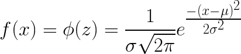
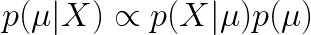
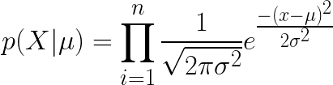
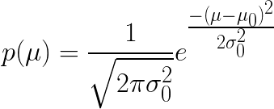
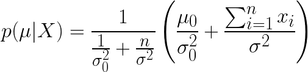
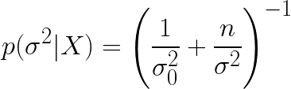

# Normal Conjugate Priors

## The Normal Distribution

* **Normal Distribution** - a continous distribution with notation <em>N(&mu;,&sigma2</em>, with mean <strong><em>&mu;</em></strong> and variance <strong><em>&sigma;2</em></strong>
  > <!--
    f(x) = \phi(z) = \frac{1}{\sigma \sqrt{2 \pi } }e^{\frac{-(x - \mu)^2}{2\sigma^2}}
    -->
* At <strong><em>x = &mu;</em></strong>, either side of the distibution is symmetrical.
* The mean, mode, and median of a normal distribution are the same.
* <strong><em>&mu; &isin; &#8477;</em></strong> (the mean is a real number)

** Example

* Suppose from a sample <strong><em>n = 30</em></strong> students
  * the mean grade was <strong><em>x&#773; = 75</em></strong>
  * the standard deviation was <strong><em>&sigma; = 10</em></strong>
* <em>What is our prior knowledge?</em> These students are taken a course that has been taught in the past many times. The class varies each time, yielding a different mean and standard deviation for each class
  * The mean of all the class means is <strong><em>&mu;0 = 70</em></strong>
  * The standard deviation for the class means is <strong><em>&sigma;0 = 5</em></strong>
* To update our knowledge of <strong><em>&mu;</em></strong>, with the new test data <strong><em>X</em></strong>, we want to find <strong><em>p(&mu;|X)</em></strong>.
* Expressed as Bayes&rsquo; Theorem where <strong><em>p(&mu;)</em></strong> is the prior knowledge of the class mean.
  > <!--
    p(\mu|X) \propto p(X|\mu) p(\mu)
    -->
* Let <strong><em>p(X|&mu;)</em></strong> be the likelihood function, assuming new data is normally distributed with mean <strong><em>&mu;</em></strong> and variance <strong><em>&sigma;2</em></strong>
  > <!--
    {p(X|\mu) = \prod_{i=1}^{n}\frac{1}{\sqrt{2\pi\sigma^2}}e^{\frac{-(x - \mu)^2}{2\sigma^2}}}
    -->
* <strong>Note:</strong> we don&rsquo;t know the true mean; we just have the means of the historical class means.
  * Let <strong><em>&mu;0</em></strong> be the mean of the class means and let <strong><em>&sigma;0</em></strong> be the standard deviation of the class means
  > <!--
    {p(\mu) = \frac{1}{\sqrt{2\pi\sigma^2_0} }e^{\frac{-(\mu - \mu_0)^2}{2\sigma^2_0}}}
    -->
* [Okay the proof is a ton of algebra, it hurts](http://www2.bcs.rochester.edu/sites/jacobslab/cheat_sheet/bayes_Normal_Normal.pdf). This is what we really want:
  * [Posterior mean](https://en.wikipedia.org/wiki/Conjugate_prior#Continuous_distributions) <strong><em>&mu;</em></strong>:
  > <!--
    {\p(\mu|X) =
    \frac{1}{\frac{1}{\sigma^2_0} + \frac{n}{\sigma^2}}
    \left(
    \frac{\mu_0}{\sigma^2_0} +
    \frac{\sum_{i=1}^{n}x_i}{\sigma^2}
    \right)}
    -->
  * Posterior variance <strong><em>&simga;2</em></strong>:
  > <!--
    {p(\sigma^2|X) = \left(\frac{1}{\sigma^2_0} + \frac{n}{\sigma^2}\right)^{-1}}
    -->

## Sources

* [Bayesian Statistics: Normal-Normal Model](http://www2.bcs.rochester.edu/sites/jacobslab/cheat_sheet/bayes_Normal_Normal.pdf) - Robert Jacobs
* [Conjugate Priors | Continuous Distributions](https://en.wikipedia.org/wiki/Conjugate_prior#Continuous_distributions) Wiki
<!--
* [The Conjugate Prior for the Normal Distribution](https://people.eecs.berkeley.edu/~jordan/courses/260-spring10/lectures/lecture5.pdf) - Michael I. Jordan
-->
<!--
* [Conjugate Bayesian analysis of the Gaussian distribution](https://www.cs.ubc.ca/~murphyk/Papers/bayesGauss.pdf) - Kevin P. Murphy
* []
-->
