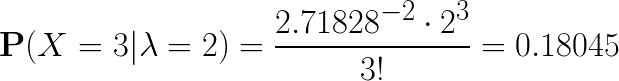
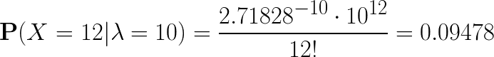

# Poisson Distribution

A Poisson distribution measures probability of events when you know how often the event has occurred. In other words, poisson process is the probability of a number of events occurring in a fixed interval. Examples:

* Observe an intersection. Success = accident occurred (time)
* Observe a stretch of highway. Success = car passes (time)
* Walk along a path. Success = see a flower (distance)

* Conditions for Poisson process:
  * The number of success of disjoint intervals is indepedent of each other. The number of success in the interval <em>[0,3]</em> is independent of the the success in <em>[6,7]</em>
  * Probability distribution of the number of successes over time depends on the length of the interval
  * Successes cannot be simultaneous

> <!--
  P(X = x) = \frac{e^{-\lambda}\lambda^x}{x!}
  -->

## Examples

* A city has on average 2 major snow events per winter. What is the probability that there will be 3 major snow events next winter?
  > <!--
  {P(X = 3|\lambda=2) = \frac{2.71828^{-2}\cdot 2^3}{3!} = 0.18045}
  -->
* In a park, the average number of deer per square mile is 10. What is the probability of finding exactly 12 deer in a square mile?
  > <!--
  {P(X = 12|\lambda=10) = \frac{2.71828^{-10}\cdot 10^{12}}{12!} = 0.09478}
  -->

## Python

### Simulate a poisson distribution by generating random values

```python
import numpy as np
import matplotlib.pyplot as plt
samples = np.random.poisson(5, 10000)
count, bins, ignored = plt.hist(samples, 14, density=True)
plt.show()
```

## Sources
* [Online equation editor](https://www.codecogs.com/latex/eqneditor.php)
* [Poisson Distribution / Poisson Curve: Simple Definition](https://www.statisticshowto.datasciencecentral.com/poisson-distribution/)
* [The Poisson Distribution](http://www.stat.wisc.edu/~wardrop/courses/371chapter4.pdf)
* [The Poisson Distribution](https://www.stat.wisc.edu/courses/st371-larget/poisson-handout.pdf)