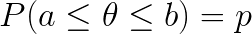
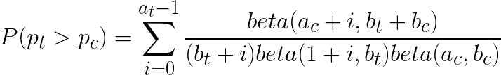

# Probability Intervals, Bayesian Statistics part II

* **p-probability interval** - a interval [a,b] for *&theta;* where
  > <!--
    P(a \le \theta \le b) = p -->
* **90% probability interval** - a.k.a 0.9-probability interval a.k.a. **credible interval**
  * Example: if quantile is 0.05 to 0.55 then we have a 0.5 probability interval
* **Symmetric probability Interval** - if the amount of remaining probability on either side is equal.
  * Example [q0.25,q0.75]
* There are many intervals of equal value, but the widths will be different because the probability curve will vary. For example a 0.9 probability interval defined near the center of a normal distribution will be smaller than one towards either edge.

## Uses

* Probability Intervals are intuitive.
  "I think &theta; is between 0.3 to 0.7 with 90% probability"
* In Bayesian updating, the interval gets smaller in the posterior. Additional data makes us more certain.

## What about priors?

* **subjective probability intervals** - If we do not have a pmf or pdf, or if we have no priors, we can construct a prior for &theta;

## Random Walk

* Choose *N* sample size
* As users access the feature, 50% will see control, 50% will see Treatment
* Let *T* be the number of successes in treatment group
* Let *C* be the number of successes in control group
* If *T-C = 2 * sqrt(N)* stop the test. The treatment is better
* If T+C = N stop the test. No Winner

* Probability Treatment is better than control
  > <!--
    P(p_t > p_c) = \sum_{i=0}^{a_t-1} \frac{beta(a_c+i,b_t+b_c)}{(b_t+i)beta(1+i,b_t)beta(a_c,b_c)}
    -->
