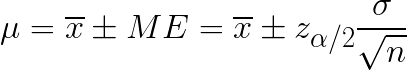
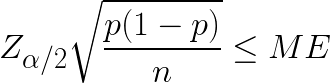
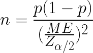
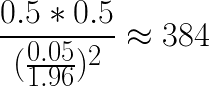
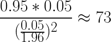
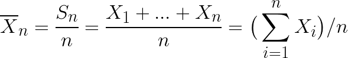
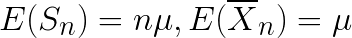
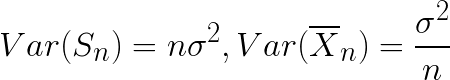

# Sampling Size

How many samples from a population do you need to see whether they possess a particular property, within a margin of error?

* **Critical Value** - the area under a normal distribution curve.
  * There is an 80% probability a result will fall within 1.28 standard deviations of the mean. So 1.28 is the critical value of *z* that corresponds to central area of 0.80.
  * *&alpha;* is the tail area. For a 0.80 central area, then there are 0.10 tail areas on either side of the curve.
  * Z-table, 2 tails
    * e.g., *P(|Z| < 1)* = 0.68 - the probability that that normal random variable is within 1 standard deviation of its mean.
  
    | confidence % | critical value | &alpha;/2             |
    |--------------|----------------|-----------------------|
    | 68.27%       | **1.000**      | *z0.159*   |
    | 80%          | 1.282          | *z0.1*     |
    | 90%          | 1.645          | *z0.05*    |
    | 95%          | 1.960          | *z0.025*   |
    | 95.45%       | **2.000**      | *z0.02275* |
    | 96%          | 2.054          | *z0.02*    |
    | 98%          | 2.326          | *z0.01*    |
    | 99.73%       | **3.000**      | *z0.00135* |
    | 99.8%        | 3.090          | *z0.001*   |
    | 99.9%        | 3.291          | *z0.0005*  |
    | 99.99%       | 3.891          | *z0.00005* |

* Margin of Error formula
  * where Z&alpha;/2 is the critical value,
  * *p* is the proportion,
  * *n* is sample size,
  * *&sigma;* is standard deviation
    > 
  * For a binomial distribution, the standard deviation is the square root of the proportion times the inverse proportion
    > 
  * Usually we don't know what the proportion is, but to maximize the margin of error, the proportion will be 50% to maximize the the formula
* Sample size:
  > 
* Examples
  * What is the proportion of customers who buy an item after viewing a website on a certain day, with a 95% confidence level and 5% margin of error, if the website sees about 10,000 customers a day? If they are uncertain of their current conversion rate, then 384 customers.
    > 
  * If they know the conversion rate is 5%, then the sample size is 73.
    > 

## Central Limit Theorem, Examples

* CLT
  > 
* Mean
  > 
* Variance
  > 
* Standard Deviation
  > 
* Out of 100 coin flips, what is the probability of more than 55 heads?
  * Let *Xj* be the result of the *jth* flip, and *Xj* = 1 for heads and *Xj* = 0 for tails
  * The sum of all the heads for 100 flips will then be *S = X1 + X1 + X2 + ... + X100*
  * Each coin flip is a Bernoulli Trial
    * Expected Value: *E(X) = p* = 0.5
    * Variance: *Var(X)* = (1 -*p*)*p* = 0.5 * 0.5 = 0.25
    * Standard Deviation of *X* is square root of its variance: 0.5
    * Expected Value of Sum of 100 coin flips *E(S)* = 0.5 * 100 = 50
    * *Var(S) = n&sigma;2* = 100 * 0.52 = 25*
    * Standard Deviation of *S* is square root of its variance: 5

## Sources

* [Critical Values of *z*](http://www.math.armstrong.edu/statsonline/5/5.3.2.html)
* [Online equation editor](http://www.sciweavers.org/free-online-latex-equation-editor)
  * interval estimateion: `\mu =  \overline{x}  \pm ME = \overline{x}  \pm z_{ \alpha/ 2}\frac{ \sigma }{ \sqrt{n} }`
  * Margin of Error: `Z_{ \alpha / 2}  \sqrt{\frac{p(1 - p)}{n}}  \leq ME`
  * Sample Size: `n = \frac{p(1-p)}{(\frac{ME}{Z_{ \alpha / 2}})^2}`
  * Example 1: `\frac{0.5 * 0.5}{(\frac{0.05}{1.96})^2}  \approx  384`
  * Example 2: `\frac{0.95 * 0.05}{(\frac{0.05}{1.96})^2}  \approx  73
`
