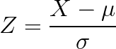

# Sampling Size

How many samples from a population do you need to see whether they possess a particular property, within a margin of error?

* **Critical Value** - the area under a normal distribution curve.
  * There is an 80% probability a result will fall within 1.28 standard deviations of the mean. So 1.28 is the critical value of *z* that corresponds to central area of 0.80.
  * *α* is the tail area. For a 0.80 central area, then there are 0.10 tail areas on either side of the curve.
  * Z-table, 2 tails
    * e.g., *P(|Z| < 1)* = 0.68 - the probability that that normal random variable is within 1 standard deviation of its mean.
  
    | confidence % | critical value | &alpha;/2             |
    |--------------|----------------|-----------------------|
    | 68.27%       | **1.000**      | *z0.159*   |
    | 80%          | 1.282          | *z0.1*     |
    | 90%          | 1.645          | *z0.05*    |
    | 95%          | 1.960          | *z0.025*   |
    | 95.45%       | **2.000**      | *z0.02275* |
    | 96%          | 2.054          | *z0.02*    |
    | 98%          | 2.326          | *z0.01*    |
    | 99.73%       | **3.000**      | *z0.00135* |
    | 99.8%        | 3.090          | *z0.001*   |
    | 99.9%        | 3.291          | *z0.0005*  |
    | 99.99%       | 3.891          | *z0.00005* |

* Margin of Error formula
  * where Z&alpha;/2 is the critical value,
  * *p* is the proportion,
  * *n* is sample size,
  * *&sigma;* is standard deviation
    > 
  * For a binomial distribution, the standard deviation is the square root of the proportion times the inverse proportion
    > 
  * Usually we don't know what the proportion is, but to maximize the margin of error, the proportion will be 50% to maximize the the formula
  * The maxima of *p(1 - p)* can be found by gettings its derivative: *1 - 2p = 0*
* Sample size:
  > 
* Examples
  * What is the proportion of customers who buy an item after viewing a website on a certain day, with a 95% confidence level and 5% margin of error, if the website sees about 10,000 customers a day? If they are uncertain of their current conversion rate, then 384 customers.
    > 
  * If they know the conversion rate is 5%, then the sample size is 73.
    > 
* **Margin of Error, rule of thumb** - A sample of *n* people will have have a margin of error:
  > 

## Central Limit Theorem, Examples

* See [Baseline Primer](./baseline-primer.md) page for description of CLT
* CLT
  > 
* Mean
  > 
* Variance
  > 
* Standard Deviation
  > 
* Out of 100 coin flips, what is the probability of more than 55 heads?
  * **Standardization** - For a random variable *X* that has a normal distribution, the standardization is:
  > 
  * Let *Xj* be the result of the *jth* flip, and *Xj* = 1 for heads and *Xj* = 0 for tails
  * The sum of all the heads for 100 flips will then be *S = X1 + X1 + X2 + ... + X100*
  * Each coin flip is a Bernoulli Trial
    * Expected Value: *E(X) = p* = 0.5
    * Variance: *Var(X)* = (1 -*p*)*p* = 0.5 * 0.5 = 0.25
    * Standard Deviation of *X* is square root of its variance: 0.5
    * Expected Value of Sum of 100 coin flips *E(S)* = 0.5 * 100 = 50
    * *Var(S) = n&sigma;2* = 100 * 0.52 = 25*
    * Standard Deviation of *S* is square root of its variance: 5
    > 
    * Another way to think of this problem is 55 is 1 standard deviation over the mean. What is the left tail over 1 standard deviation?

## How big should the sampling size be?

1. Run the test for *n* (e.g. 1000) observations
2. Run the test until a significant difference is observed

Suppose observations are made on a test after 200 and stopped after 500 observations.

<table>
    <tr>
      <th>Phase</th>
      <th>Scenario 1</th>
      <th>Scenario 2</th>
      <th>Scenario 3</th>
      <th>Scenario 4</th>
    </tr>
    <tr>
      <td>200 observations</td>
      <td>Don't reject <em>H0</em></td>
      <td>Don't reject <em>H0</em></td>
      <td bgColor="#CCFFCC">Reject <em>H0</em></td>
      <td bgColor="#CCFFCC">Reject <em>H0</em></td>
    </tr>
    <tr>
      <td>500 observations</td>
      <td>Don't reject <em>H0</em></td>
      <td bgColor="#CCFFCC">Reject <em>H0</em></td>
      <td>Don't reject <em>H0</em></td>
      <td bgColor="#CCFFCC">Reject <em>H0</em></td>
    </tr>
    <tr>
      <td>End Result</td>
      <td>Don't reject <em>H0</em></td>
      <td bgColor="#CCFFCC">Reject <em>H0</em></td>
      <td>Don't reject <em>H0</em></td>
      <td bgColor="#CCFFCC">Reject <em>H0</em></td>
    </tr>
</table>

Suppose the test is stopped after something significant happens.

<table>
    <tr>
      <th>Phase</th>
      <th>Scenario 1</th>
      <th>Scenario 2</th>
      <th>Scenario 3</th>
      <th>Scenario 4</th>
    </tr>
    <tr>
      <td>200 observations</td>
      <td>Don't reject <em>H0</em></td>
      <td>Don't reject <em>H0</em></td>
      <td bgColor="#CCFFCC">Reject <em>H0</em></td>
      <td bgColor="#CCFFCC">Reject <em>H0</em></td>
    </tr>
    <tr>
      <td>End Result</td>
      <td>Don't reject <em>H0</em></td>
      <td bgColor="#CCFFCC">Reject <em>H0</em></td>
      <td>Stop</td>
      <td>Stop</td>
    </tr>
    <tr>
      <td>500 observations</td>
      <td>Don't reject <em>H0</em></td>
      <td bgColor="#CCFFCC">Reject <em>H0</em></td>
      <td bgColor="#CCFFCC">Reject <em>H0</em></td>
      <td bgColor="#CCFFCC">Reject <em>H0</em></td>
    </tr>
</table>

<table>
  <tr>
    <td>Type I Error <em>&alpha;</em></td>
    <td>Probability of rejecting <em>H0</em> even though it's true</td>
  </tr>
  <tr>
    <td>Type II Error <em>&beta;</em></td>
    <td>Probability of not rejecting <em>H0</em> even though it's false</td>
  </tr>
  <tr>
    <td>1 - <em>&beta;</em></td>
    <td><strong>Power</strong> - probability of rejecting <em>H0</em> when it's false</td>
  </tr>
  <tr>
    <td><em>&sigma;20</em> and em>&sigma;2A</em></td>
    <td>Variances of <em>H0</em> and <em>HA</em></td>
  </tr>
  <tr>
    <td><em>&mu;0</em> and <em>&mu;A</em></td>
    <td>Means of <em>H0</em> and <em>HA</em></td>
  </tr>
  <tr>
    <td><em>n0</em> and <em>nA</em></td>
    <td>Sample sizes of <em>H0</em> and <em>HA</em></td>
  </tr>
</table>

## power analysis for two independent proportions

## Power Analysis for 2 Independent Proportions

* We want to determine the size of two samples with binomial distributions such that there is a &delta; difference between the two.
* For example, if sample 1 has probability of 0.1 and we want to [detect a 10% difference](https://signalvnoise.com/posts/3004-ab-testing-tech-note-determining-sample-size) between sample 2, then sample 2 should have a probability of 0.11
  * **Sensitivity** - the size of the difference
  * **Power Analysis** - a tool to determine the minimum sample size required to be reasonably confident that a meaningful difference can be detected between two values
  * **Independent** - these two samples, A and B don't depend on each other
  * **Proportins** - dealing with binomial distributions
> 
* Example
  * With a current conversion rate of 10%, we want to detect a 10% difference
  * The treatment should at least have a 0.10 * (1 + 0.1) = 0.11 conversion rate
  * Want a power of 80% (*&beta;* = 0.8) and a 5% significance level (*&alpha;* = 0.05), [we get](https://select-statistics.co.uk/calculators/sample-size-calculator-two-proportions/):
  > 

> 

> 

> 

## Sources

* [Critical Values of *z*](http://www.math.armstrong.edu/statsonline/5/5.3.2.html)
* [Online equation editor](http://www.sciweavers.org/free-online-latex-equation-editor)
  * interval estimateion: `\mu =  \overline{x}  \pm ME = \overline{x}  \pm z_{ \alpha/ 2}\frac{ \sigma }{ \sqrt{n} }`
  * Margin of Error: `Z_{ \alpha / 2}  \sqrt{\frac{p(1 - p)}{n}}  \leq ME`
  * Sample Size: `n = \frac{p(1-p)}{(\frac{ME}{Z_{ \alpha / 2}})^2}`
  * Example 1: `\frac{0.5 * 0.5}{(\frac{0.05}{1.96})^2}  \approx  384`
  * Example 2: `\frac{0.95 * 0.05}{(\frac{0.05}{1.96})^2}  \approx  73`
  * 55 coin example `P(S > 55) = P\left ( \frac{S-50}{5} > \frac{55-50}{5} \right ) \approx P(Z > 1) = 0.16`
  * margin of error rule of thumb: `ME = 1\pm\sqrt{n}`
  * rule of thumb: `n = \frac{16}{\Delta^{2}}`
  * delta: `\Delta = \frac{\mu_{0} - \mu_{1}}{\sigma} = \frac{\delta}{\sigma}`
  * sample size, 2 population means: `  n= \frac{2(z_{1-\alpha/2}+z_{1-\beta})^{2}}{\left (  \frac{\mu_{0} - \mu_{1}}{\sigma}  \right )^{2}}`
  * power analysis sample size: `n = (Z_{\alpha/2}+Z_{1-\beta})^{2}* \frac{p_1(1-p_1)+p_2(1-p_2) }{(p_1-p_2)^2}`
  * power analysis example: `n = (1.96+0.84)^{2}\frac{0.1879}{(0.01)^2}  = 14748`
* [How Not To Run an A/B Test](https://www.evanmiller.org/how-not-to-run-an-ab-test.html)
* [Sample Size](http://vanbelle.org/chapters%5Cwebchapter2.pdf)
* [A/B Testing Tech Note: determining sample size](https://signalvnoise.com/posts/3004-ab-testing-tech-note-determining-sample-size)
* [Comparing Two Proportions – Sample Size](https://select-statistics.co.uk/calculators/sample-size-calculator-two-proportions/)
