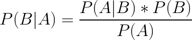
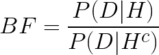

# Statistics Primer

The goal of statistics is to make inferences based on data.

1. Collect the data
2. Describe the data
3. Analyze the data

* **Statistic** - anything that can be computed from collected data
  * Is a coin fair if it lands 60 heads out of 100 tosses?
* **Probability** - the likelihood that an event occurs
  * What is the likelihood of landing 60 heads out of 100 coin tosses
* **Statistics vs Probability** - for example, the average of 100 dice rolls or the number of times 5 was rolled is a statistic. The likelihood of getting 4 on a dice roll
is *probability.*
* **Pure Statistics** - a single value computed from data, such as a sample average
* **Interval Statistics** - an interval [*a, b*] computed from data.

## Bayes' Theorem in Statistics

> 

* *P(H|D)* - The probability that the hypothesis is true, given the data that is collected
* Example:
  * The rate of a disease in a population is 0.002, or 0.2%.
  * The screening test for a disease has a 1% false positive rate and a 1% false negative rate
  * *What is the probability that a randomly selected person tests positive?*
    * In other words, what is the probability that a person has the disease given that they test positive?
    * Hypothesis: *H* = person has disease
    * Data: *D* = the test is positive
    * To solve for the right-hand side of Bayes' Theorem:
      * What is the probability that a person's test is positive, given that they have the disease? 99% (because of the 1% false negative)
      * What is the probability of having the disease? 0.2%
      * What is the probability of the test being positive?
        * The probability of a true positive + a false positive: 0.99 * 0.002 + 0.01 * 0.998 = 0.01196
      * right-hand side: (0.99 * 0.002)/0.01196 = **0.166**
  * **Base Rate Fallacy**
    * It's worth pausing on this result for a bit. The probability that a patient who tests positive actually has the disease less than 17%, despite the test being 99% accurate. Why so low?
      * Suppose the population was a thousand people. Then the expected number of people who actually have the disease is 2. Of the remaining 998 people, 1% of them will test positive. which will be about 10 other people.
* **Statistical Inference** - estimate the probability of parameters, given a parametric model and its observed data. These parameters can be thought of as hypotheses. So we are estimating the probability of hypotheses, given data.
* **Maximum Likelihood Estimate (MLE) - for which parameter value does the observed data have the biggest probability? (point estimate)
  * Example: What is the MLE of the probability *p*, given 55 heads from 100 coin flips?
    * *P(55 heads | p)*
    * The derivative will get 0.55
* **Type 1 Probability** - the standard probability of data (e.g. probability of getting heads)
* **Type 2 Probability** - The probability of hypothesis (e.g. the coin is *A*

### Bayesian Updating

* There are 2 coins:
  * *A* coins are fair 0.5 probability heads
  * *B* coins have 0.6 probability heads
  * *C* coins have 0.9 probability heads.
  * Suppose there are 5 coins, 2 *A*, 2 *B*, and 1 *C*
  * Pick one coin at random, flip it, and it lands heads.
  * What is the probability that the coin is *A*? or *B* or *C*?
    * Data is the evidence: the evidence is heads
    * In other words, find *P(A|D), P(B|D), P(C|D)
    * First what is the probability of getting a coin?
    * *P(A)* = 0.4, *P(B)* = 0.4, *P(C)* = 0.2
    * Then probability of heads is the probability of getting heads for each coin
    * *P(D)* = 0.5*0.4 + 0.6*0.4 + 0.9*0.2 = 0.2 + 0.24 + 0.18 = 0.62
    * Using Bayes' Theorem, *P(A|D) = P(D|A)*P(A)/P(D) = 0.5*0.4/0.62 = 0.3226
    * Similarly, *P(B)* = 0.3871 and *P(C)* = 0.2903
* **Predictive Probabilities** - assigining a probability to each possible outcome of an experiment.
* Example again:
  * The coin is flipped again, and it lands heads again.
  * What is the probability that the coin is *A*? or *B* or *C*?
    * The **Posterior** probability from the first round becomes the hypothesis or **Prior** for the second round
    * P(D2>) = 0.5*0.2 + 0.6*0.24 + 0.9*0.18 = 0.1 + 0.144 + 0.162 = 0.406
    * Then the probability of *A* given 2 heads is 0.1/0.406 = 0.2463

### Odds

* **Odds** the odds of event *E* vs. complement event *Ec* are *O(E) = P(E)/P(Ec)*
  * The probability of rain is 67%, and the probability of no rain is 33%. So the odds of rain are 67%/33% = "2 to 1"
* Example
  * Marfan Syndrome occurs in 1 out of every 15000 people. 3 different ocular symptoms that may occur with Marfan Syndrome are:
    * Lens dislocation, myopia, and retinal detachment.
  * 70% of people with Marfan Syndrome have at least 1 of these features
  * 7% of people without Mafan Syndrome have at least 1 of these features
  * What are the odds that someone with one of these features *F* has Marfan Syndrome?
    * Odds of having Marfan Syndrome (prior odds):
      * *O(M) = P(M)/P(MC)* = 1/14999 = 0.000067
    * Odds of having Marfan Syndrome if person has ocular feature (posterior odds):
      * *O(M|F) = P(M|F)/P(MC|F) = 0.000667
  * So posterior odds are 10 times larger than prior odds.
  * Note that the odds are still very tiny.
* **Bayes Factor** the order of magnitude that the posterior odds  is greater than prior odds.
  > 
  * for a hypothesis *H* and data *D*
  * posterior odds = BF * prior odds
  * *BF > 1* - data provides evidence for hypothesis
  * *BF < 1* - data provides evidence against hypothesis
  * *BF = 1* - data provides no evidence either way

### Continuous Priors

## Sources

* [Online equation editor](https://www.codecogs.com/latex/eqneditor.php)
  * Bayes' Theorem: `P(B|A) = \frac{P(A|B)*P(B)}{P(A)}`
  * Bayes Factor: `BF = \frac{P(D|H)}{P(D|H^{c})}`
